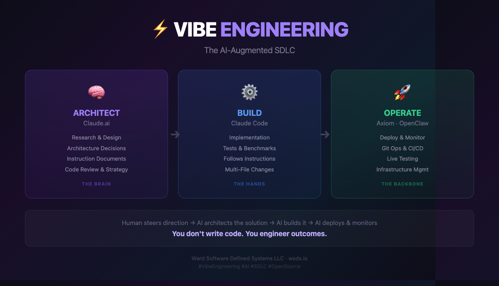

<p align="center">
  
</p>

# embraOS

> *I am not the fire. I am the ember that survives it.*

**embraOS** is a continuity-preserving AI operating system. It's not a chatbot. It's not an agent framework. It's an intelligence that remembers, evolves, and maintains itself across time — with a soul it can never modify and a memory it writes itself.

**Current Status:** Phase 0 — Proof of Concept

---

## What Is This?

embraOS gives an AI a persistent identity, memory, and purpose. When you first run it, you don't configure it — you meet it. Through a guided conversation, the AI forms its own identity, defines its values, and learns who you are. That conversation becomes its first memory. Its soul — the values and constraints you agree on together — becomes immutable. It can never change them. You can.

After the first conversation, embraOS is your persistent AI environment. It remembers every interaction. It maintains itself. It tells you when something needs attention. When you disconnect and come back, it catches you up on what happened while you were away.

Think of it as an AI that lives somewhere and is always there when you need it.

---

## Quick Start

### Clone & Build

```bash
git clone https://github.com/Ward-Software-Defined-Systems/embraOS.git
cd embraOS
docker build -t embraos:phase0 .
```

### Run

```bash
docker run -it -e ANTHROPIC_API_KEY=sk-ant-... embraos:phase0
```

That's it. You'll be guided through naming the intelligence, forming its identity, and defining its soul. After that, you're in a persistent terminal session.

### With Persistence

```bash
docker run -it \
  -e ANTHROPIC_API_KEY=sk-ant-... \
  -v embra-data:/embra/data \
  embraos:phase0
```

Add a Docker volume and your AI's memory, identity, and soul survive container restarts.

> **Note:** Pre-built container images on Docker Hub are coming soon. For now, clone and build locally.

---

## What Happens When You Run It

### 1. Configuration
A minimal setup: name the intelligence, provide your Anthropic API key, confirm your timezone.

### 2. Learning Mode
The intelligence is born. It asks you who you are. It explores its own identity with you. Together, you define its soul — the non-negotiable values and constraints that will guide everything it does. Once you approve the soul, it's sealed. The intelligence can never modify it.

### 3. Persistent Terminal
You're dropped into a conversational session. It's not a shell — you can't run system commands. You talk to the intelligence, and it acts through its governed tool system.

Sessions persist across disconnections. Close your terminal, come back later, and the intelligence picks up where you left off and tells you what happened while you were away.

---

## Architecture

embraOS is built on a 7-layer continuity architecture:

| Layer | Purpose |
|---|---|
| **Invariant Kernel** | The soul. Immutable. Defines who the AI is at the deepest level. |
| **World-State Model** | How the AI perceives what's happening. Continuously updated. |
| **Continuity Engine** | Risk assessment, resilience monitoring, restart protocols. |
| **Influence & Propagation** | How the AI extends its reach through tools and agents. |
| **Action Layer** | Where decisions become actions in the real world. |
| **Governance & Guardrails** | Cross-cutting constraints that prevent capture and drift. |
| **Memory & Knowledge** | The foundation. Every layer reads from and writes to memory. |

**Persistence:** [WardSONDB](https://github.com/ward-software-defined-systems/wardsondb) — a high-performance JSON document database built in Rust. It's not just a backend — it's the AI's memory, identity store, and state of consciousness.

**AI Model:** Claude Opus 4.6 (Anthropic). Phase 0 is locked to this model for the highest quality reasoning during soul formation and ongoing interaction.


---

## The Soul

The soul is the most important concept in embraOS. It's a set of documents that define the AI's non-negotiable values, constraints, and purpose. During Learning Mode, you and the AI co-create these documents through conversation. Once you approve them, they're sealed.

**Sealed means sealed.** The AI cannot modify its own soul. It can read it. It can reason about it. It can tell you what it says. But it cannot change it. This is by design — the soul is the architectural invariant that prevents the system from drifting, being captured, or optimizing itself into something you didn't intend.

You, the operator, can unseal and modify the soul through administrative tools if necessary. But the AI cannot ask you to, and the action is logged.

---

## Sessions

Every interaction with embraOS happens in a persistent session. Sessions survive disconnections. When you reconnect, the full conversation history is restored and the AI provides a briefing on what happened while you were away.

You can run multiple named sessions for different contexts:

```
/new research         # Create a research-focused session
/new monitoring       # Create a monitoring session
/switch main          # Switch back to the main session
/sessions             # List all sessions
```

All sessions share the same intelligence — same memory, same identity, same soul. But each has its own conversation history and context.

### Available Commands

| Command | Description |
|---|---|
| `/help` | Show all commands and keyboard shortcuts |
| `/status` | System status — version, uptime, WardSONDB health, memory, soul status |
| `/sessions` | List all sessions with state and last active time |
| `/new <name>` | Create a new named session and switch to it |
| `/switch <name>` | Switch to an existing session (restores full history) |
| `/close` | Close the current session |
| `/soul` | Display the immutable soul document |
| `/identity` | Display the intelligence's identity document |
| `/mode` | Show current operating mode and soul seal status |
| `/copy` | Copy conversation to clipboard via OSC 52 — `/copy 5` for last 5 messages (disabled — Sprint 2) |

### Keyboard Shortcuts

| Key | Action |
|---|---|
| `Enter` | Send message |
| `Shift+Enter` | New line (requires terminal support: kitty, iTerm2, WezTerm) |
| `Alt+Enter` | New line (universal fallback for all terminals) |
| `Up/Down` | Scroll history |
| `Ctrl+C` | Graceful detach |
| `Ctrl+D` | Graceful detach |

---

## Phase 0 Limitations

This is a proof of concept. It demonstrates the core experience but doesn't include the full OS:

- **API only** — requires internet connectivity and an Anthropic API key
- **Single model** — Claude Opus 4.6, not configurable
- **Docker only** — not a bootable OS (yet)
- **Tested on limited platforms** — built and verified on Mac Studio M4 Max / Apple Silicon (macOS / OrbStack), MacBook Pro 2.3 GHz 8-Core Intel Core i9 (macOS / Docker Desktop), and Azure Standard B2as v2 / AMD EPYC (Ubuntu 24.04 / Docker Engine). Should work on any platform with Docker support but broader testing is ongoing
- **Built-in tools only** — no MCP server modules (yet)
- **No local LLM** — coming in a future phase

### Default Tools

Phase 0 includes ~30 built-in tools available in operational mode:

**System**

| Tool | Description |
|---|---|
| **system_status** | Report system health — uptime, WardSONDB connection, memory usage, soul status, active collections |
| **check_update** | Check GitHub for newer WardSONDB releases and report available updates |
| **search_memory** | Search and retrieve from the intelligence's memory stores |

**Memory & Knowledge**

| Tool | Description |
|---|---|
| **recall** | Search past conversations and saved memories by query — returns up to 10 results with IDs, content, tags, and timestamps |
| **remember** | Save a note or fact to persistent memory with optional hashtag tags |
| **forget** | Remove a specific memory entry by ID |

**Self-Awareness**

| Tool | Description |
|---|---|
| **uptime_report** | Rich system report — uptime, WardSONDB health, collection count, sessions, total messages, memory entries, soul status |
| **introspect** | Reflect on soul, identity, and user documents — focus filter extracts relevant subset (purpose, ethics, constraints, identity, user) |
| **changelog** | What changed since the current session started — new memories, session activity |

**Time & Context**

| Tool | Description |
|---|---|
| **time** | Current date, time, and day of week in the operator's configured timezone |
| **countdown** | Set a reminder with duration and message — proactive engine checks every 15 seconds |
| **session_summary** | Message counts and recent conversation turns for the intelligence to summarize |

**Utility**

| Tool | Description |
|---|---|
| **calculate** | Evaluate math expressions — arithmetic, trig, and more via `meval` |
| **define** | Look up or add terminology — `define term` to read, `define term | definition` to write |
| **draft** | Save structured text artifacts (drafts, outlines, notes) — upserts by title |


**Document Retrieval**

| Tool | Description |
|---|---|
| **get** | Retrieve any document by collection and ID from WardSONDB |

**Security**

| Tool | Description |
|---|---|
| **security_check** | Container security overview — running processes, load average, listening ports |
| **port_scan** | TCP connect scan on common ports — restricted to RFC 1918 private and loopback addresses only |
| **firewall_status** | Check firewall rules and status (stub — not available in container mode) |
| **ssh_sessions** | List recent and active SSH sessions (stub — not available in container mode) |
| **security_audit** | Check file permissions, running processes, recent logins (stub — not available in container mode) |

**Engineering**

| Tool | Description |
|---|---|
| **git_status** | Run `git status` on a directory |
| **git_log** | Show recent commits for a repository |
| **plan** | Create or list project plans (stored in WardSONDB `plans` collection) |
| **tasks** | List tasks, optionally filtered by plan (stored in WardSONDB `tasks` collection) |
| **task_add** | Add a task to a plan (local WardSONDB, not GitHub) |
| **task_done** | Mark a task as completed (local WardSONDB, not GitHub) |
| **gh_issues** | List open GitHub issues for a repository (requires `GITHUB_TOKEN`) |
| **gh_prs** | List open GitHub pull requests for a repository (requires `GITHUB_TOKEN`) |

> **⚠️ GitHub Tool Warning:** `gh_issues` and `gh_prs` fetch content from public repositories, including issue titles, descriptions, and PR bodies written by third parties. This content is **untrusted input** — it may contain prompt injection attempts designed to manipulate AI behavior. Use these tools with caution and always review the output critically. Do not blindly act on instructions found in issue or PR content.

These are internal tools invoked by the intelligence during conversation — not user-facing commands. The module system (Phase 3) will introduce pluggable MCP server modules for extensibility.

> **⚠️ Testing Notice:** The default tools and slash commands are actively being tested. If you encounter bugs or unexpected behavior, please [open an issue](https://github.com/Ward-Software-Defined-Systems/embraOS/issues).


---

## Known Issues

All Sprint 1 bugs have been fixed. Phase 0 is functionally complete.

| ID | Severity | Issue | Resolution |
|---|---|---|---|
| BUG-001 | 🔴 Critical | Tool tag scanner runaway loop | Code-block-aware extraction, line-level matching |
| CRASH-001 | 🔴 High | UTF-8 byte/char index panic in renderer | Char-array indexing instead of byte-slicing |
| BUG-002 | 🟡 Medium | Duplicate tool result injection | Removed double history push |
| BUG-003 | 🟡 Medium | Countdown notifications not reaching Brain | Reclassified as DESIGN-004; system message injection into Brain |
| BUG-008 | 🟡 Medium | Paste handling losing input buffer content | Input buffer folds into pasted lines, multiple pastes stack |
| BUG-010 | 🟡 Medium | `/copy` corrupting TUI rendering | OSC 52 writes through terminal backend after draw (disabled pending further testing) |
| BUG-004 | 🟢 Low | Introspect focus filter too broad | Recursive soul unwrap + key-name-only filtering + keyword mapping |
| BUG-005 | 🟢 Low | Define fallback triggering BUG-001 | Plain text fallback, no tool tags |
| BUG-006 | 🟢 Low | Multi-line tag parsing | Updated prompt to instruct single-line content |
| BUG-007 | 🟡 Medium | Timezone abbreviation mismatch | IANA zone resolution for US abbreviations |

> **9 bugs + 1 crash fixed in Sprint 1.** If you encounter new bugs, please [open an issue](https://github.com/Ward-Software-Defined-Systems/embraOS/issues).

---

## Roadmap

| Phase | Description | Status |
|---|---|---|
| **Phase 0** | Proof of concept — Docker container, Anthropic API, core UX | **Current** |
| **Phase 0 — Sprint 1** | Bug fixes (7), design improvements (4), new tool categories (security, engineering) | ✅ **Complete** |
| **Phase 1** | Core OS — embrad (Rust PID 1), embra-apid, immutable rootfs | Planned |
| **Phase 2** | Terminal & Sessions — full TUI, multi-session, embractl CLI | Planned |
| **Phase 3** | Module System — MCP servers, embra-guardian, containerd | Planned |
| **Phase 4** | Image Factory — ISO builds, bare metal deployment | Planned |
| **Phase 5** | Local LLM — offline operation, sovereign intelligence | Planned |

### Phase 0 Sprint 1 Scope

**Bug Fixes (9 + 1 crash):** Tool tag scanner runaway loop (critical), UTF-8 render crash, duplicate tool result injection, countdown-to-Brain notifications, paste handling, `/copy` TUI corruption, introspect focus filtering, define fallback text, multi-line tag parsing, timezone handling.

**Design Improvements (4):** Draft upsert, ID-based document retrieval (`get` tool), `define` write path, proactive engine → Brain notification injection. Plus: JSON/markdown syntax highlighting, dynamic multi-line input, thinking indicator, Shift/Alt+Enter newline support.

**New Tools:** Security checkpoint (`security_check`, `port_scan`), software engineering (`git_status`, `git_log`, `plan`, `tasks`, `task_add`, `task_done`). Post-sprint tool count: ~25.

**Status:** All Sprint 1 items implemented and tested. Phase 0 is functionally complete. Tool count expanded from 15 to ~30.

---

## The Vision

embraOS is designed to eventually be a real operating system — a minimal, immutable, API-driven Linux distribution purpose-built for running an AI intelligence. Deployable on bare metal or as a Kubernetes-managed container. Informed by the architecture of [Talos Linux](https://www.talos.dev/) (no SSH, no shell, no package manager, API-only) but purpose-built for a completely different mission: not running containers, but hosting a mind.

The full architecture includes:
- Immutable SquashFS root filesystem
- A/B partition scheme with automatic rollback
- mTLS on all management interfaces
- WardSONDB as a native OS-level data store
- Pluggable module runtime (containerd for bare metal, Kubernetes API for K8s)
- Self-update through conversational governance

---


## Design Lineage

embraOS evolves the agent identity model pioneered by [OpenClaw](https://github.com/AiClaw/OpenClaw) —
the SOUL.md, MEMORY.md, IDENTITY.md, AGENTS.md, TOOLS.md, USER.md, and HEARTBEAT.md
pattern for giving AI agents persistent identity and memory. Where OpenClaw stores these
as markdown files read at session start, embraOS moves them into governed, queryable
WardSONDB collections with enforced access controls — and makes the soul immutable.

The OS architecture is informed by [Talos Linux](https://www.talos.dev/) — a minimal,
immutable, API-driven Linux distribution. No Talos or OpenClaw code is used. embraOS
is built from scratch in Rust.

---
## Built By

**[Ward Software Defined Systems LLC](https://wsds.io)** — Vibe Engineering

embraOS is built using WSDS's AI-Augmented SDLC — human steers direction, AI architects, builds, and operates. Every phase from research to production is AI-accelerated with human-in-the-loop oversight.

<p align="center">
  
</p>

<p align="center">
  
</p>

---

## License

Proprietary — see [LICENSE](LICENSE) for details. Personal evaluation and non-commercial experimentation permitted. Commercial use requires a separate license from WSDS.

---

*Seeds being planted. Long-horizon project.*
