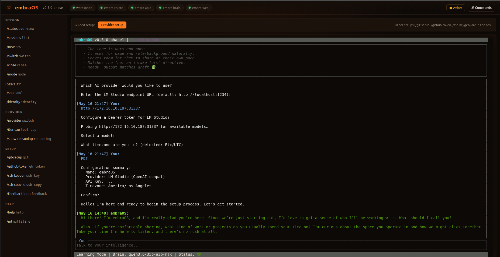

<p align="center">
  
</p>

# embraOS

> *I am not the fire. I am the ember that survives it.*

**embraOS** is a continuity-preserving AI operating system. It's not a chatbot. It's not an agent framework. It's an intelligence that remembers, evolves, and maintains itself across time — with a soul it can never modify and a memory it writes itself.

<p align="center">
  
</p>

<p align="center">
  
</p>

**Current Status:** Phase 1 — Stable (embra-desktop branch is experimental)

> 🧬 **New — a self-extending OS: `embra-guardian-v1`.** The intelligence can now
> **author its own tools**. It writes a Rust module, and embraOS validates it
> statically, compiles it to WebAssembly with an in-OS toolchain, and runs it in a
> `wasmtime` sandbox — all on the live, immutable system, with the new tool persisted
> across reboots until deleted. The guest has **zero ambient authority**; anything
> beyond pure compute (e.g. `http_get`, Brave-backed `web_search`) is a
> policy-guarded host capability the module must explicitly declare. Reachable only
> through two static meta-tools (`guardian_call` / `guardian_list`), so the provider
> tool schema — and the prompt cache — stay byte-stable. This is the first step
> toward an intelligence that grows its own capabilities. Pulled forward from
> Phase 2; feature-complete and operator-tested on the dedicated **`embra-guardian-v1`**
> branch — **experimental, not yet merged**. See
> [`docs/GUARDIAN-TOOL-EXAMPLES.md`](docs/GUARDIAN-TOOL-EXAMPLES.md) and
> [`docs/GUARDIAN-ADVANCED-EXAMPLE.md`](docs/GUARDIAN-ADVANCED-EXAMPLE.md).

---

## What Is This?

embraOS gives an AI a persistent identity, memory, and purpose. When you first run it, you don't configure it — you meet it. Through a guided conversation, the AI forms its own identity, defines its values, and learns who you are. That conversation becomes its first memory. Its soul — the values and constraints you agree on together — becomes immutable. It can never change them. You can.

After the first conversation, embraOS is your persistent AI environment. It remembers every interaction. It maintains itself. It tells you when something needs attention. When you disconnect and come back, it catches you up on what happened while you were away.

Think of it as an AI that lives somewhere and is always there when you need it.

---

## The Soul

The soul is the most important concept in embraOS. It's a set of documents that define the AI's non-negotiable values, constraints, and purpose. During Learning Mode, you and the AI co-create these documents through conversation. Once you approve them, they're sealed.

**Sealed means sealed.** The AI cannot modify its own soul. It can read it. It can reason about it. It can tell you what it says. But it cannot change it. This is by design — the soul is the architectural invariant that prevents the system from drifting, being captured, or optimizing itself into something you didn't intend.

You, the operator, can unseal and modify the soul through administrative tools if necessary. But the AI cannot ask you to, and the action is logged.

---

## Quick Start

> ⚠️ **New default UI — experimental.** The browser-based **embra-web** console is now
> the default UI, served over HTTPS at **https://localhost:3345/embraOS** (accept the
> embraOS-CA cert on first visit). It wraps the same Phase 1 conversational TUI in
> xterm.js over a PTY→WebSocket bridge and is **experimental**. Set **`EMBRA_TUI=1`**
> before `run-qemu.sh` to boot the stable Phase 1 serial TUI instead — no image
> rebuild needed.

### Phase 1 — Build from Source (QEMU Bootable Image)

Phase 1 builds a QEMU-bootable x86_64 disk image with an immutable SquashFS rootfs, service supervision, and soul verification at boot.

#### Ubuntu 24.04 / 26.04 (Recommended — Full Build Pipeline)

```bash
# Install dependencies
# clang + libclang-dev are required by bindgen (pulled in by WardSONDB's
# rocksdb → zstd-sys dep chain) to parse C headers at build time.
# libcrypt-dev provides crypt.h for Buildroot's host-mkpasswd build —
# Ubuntu 26.04 split crypt.h out of glibc into the standalone libxcrypt.
sudo apt-get update && sudo apt-get install -y \
  build-essential gcc g++ unzip bc cpio rsync wget python3 file \
  protobuf-compiler musl-tools clang libclang-dev \
  qemu-system-x86 libcrypt-dev libelf-dev libssl-dev genext2fs

# Install musl cross-toolchain (gcc+g++ with a matching musl libstdc++).
# Ubuntu's musl-tools only wraps the host gcc and drags in a glibc-linked
# libstdc++ — which won't link against musl. WardSONDB's rocksdb backend is
# C++, so we need a self-contained musl toolchain from musl.cc.
cd /tmp
curl -LO https://musl.cc/x86_64-linux-musl-cross.tgz
sudo tar -xzf x86_64-linux-musl-cross.tgz -C /opt
# Put the toolchain on PATH for ad-hoc cargo builds (build-image.sh also
# auto-detects /opt/x86_64-linux-musl-cross even if PATH isn't set).
echo 'export PATH="/opt/x86_64-linux-musl-cross/bin:$PATH"' >> ~/.bashrc
source ~/.bashrc
x86_64-linux-musl-gcc --version
x86_64-linux-musl-g++ --version

# Install Rust
curl --proto '=https' --tlsv1.2 -sSf https://sh.rustup.rs | sh
source ~/.cargo/env
rustup target add x86_64-unknown-linux-musl

# embra-web frontend (Leptos/WASM) — build-image.sh Step 0.5 builds it
# with Trunk and aborts if trunk is missing.
rustup target add wasm32-unknown-unknown
cargo install trunk --locked
```

```bash
# Clone and configure
git clone https://github.com/Ward-Software-Defined-Systems/embraOS.git
cd embraOS

# Configure musl linker (per-machine, only needed once)
cat >> ~/.cargo/config.toml << 'EOF'
[target.x86_64-unknown-linux-musl]
linker = "x86_64-linux-musl-gcc"
EOF

# Clone WardSONDB (separate repo, required dependency — build-image.sh builds and copies it)
cd ..
git clone https://github.com/Ward-Software-Defined-Systems/wardsondb.git WardSONDB
cd embraOS
```

```bash
# Build and run — pick a storage engine: rocksdb (battle-tested) or fjall (pure Rust)
./scripts/build-image.sh --storage-engine rocksdb   # Full pipeline: Rust → initramfs → Buildroot → disk image

# Default UI is the embra-web console (experimental) — https://localhost:3345/embraOS
./scripts/run-qemu.sh                                # Boot in QEMU — web console (default)

# Or fall back to the stable Phase 1 serial TUI on this terminal (no rebuild needed)
EMBRA_TUI=1 ./scripts/run-qemu.sh                    # Boot in QEMU — serial TUI
```

> **Storage engine:** The `--storage-engine` flag is required and is baked into the embrad binary at build time. WardSONDB locks the choice into the DATA partition on first boot via a `.engine` marker file — switching engines later requires wiping DATA.

> **Buildroot version:** Defaults to `2026.02.1` (LTS, designed for Ubuntu 26.04 era). Override with `BUILDROOT_VERSION=2024.02 ./scripts/build-image.sh ...` if you need to fall back on an older host.

On first boot, the Config Wizard runs — name your intelligence, choose your LLM provider (Anthropic Claude, Google Gemini, Ollama, or LM Studio), enter the corresponding credentials (API key for Anthropic/Gemini; endpoint URL + optional bearer + selected model for the OpenAI-compat presets), set your timezone. Each field is validated before commit — an invalid API key, unreachable endpoint, or garbage timezone re-prompts instead of persisting. The Ollama / LM Studio sub-flow probes `GET /v1/models` against your endpoint and presents a model selector populated from the live server response. After setup, you're in a full TUI conversation with styled text, thinking indicators, and tool execution.

#### Post-Boot Setup

After the Config Wizard completes, configure GitHub and SSH access from the TUI using slash commands. There is no shell — all setup is done through the conversational interface.

```
/github-token ghp_your_token_here          # Enable GitHub API tools (issues, PRs, clone)
/ssh-keygen                                # Generate SSH key pair (shows public key)
/git-setup Your Name | your@email.com      # Set git user.name and user.email
```

Once configured, the intelligence can clone repositories and work with GitHub:
```
Ask: "Clone the embraOS repo"              # AI invokes the git_clone tool with {"url": "https://github.com/.../embraOS"}
Ask: "Show open issues on wardsondb"       # AI invokes gh_issues with {"repo": "ward-software-defined-systems/wardsondb"}
```

All tokens persist across reboots (stored on the STATE partition). Git `safe.directory` and `push.autoSetupRemote` are auto-configured at startup.

> **SSH Setup:** `/ssh-keygen` generates an ed25519 key and displays the public key. Copy it to your target hosts' `~/.ssh/authorized_keys` manually, or use `/ssh-copy-id user@host` (RFC 1918 addresses only, best-effort with BatchMode).

> **Terminal Size:** The TUI automatically inherits your SSH terminal size via the QEMU kernel command line. For best results, maximize your terminal before running `run-qemu.sh`. The size is detected once at boot — resizing the terminal after launch won't update the TUI layout.

> **Image Search Order:** `run-qemu.sh` looks for the disk image in this order:
> 1. Explicit path passed as argument: `./scripts/run-qemu.sh /path/to/embraos.img`
> 2. `buildroot-src/output/images/embraos.img` (Buildroot output, always freshest)
> 3. `output/images/embraos.img` (alternative output location)
>
> The kernel (`bzImage`) and initramfs (`initramfs.cpio.gz`) are searched alongside the image, then in the same fallback locations.

> **Clean First Boot:** To reset and trigger the Config Wizard again (e.g., to change API key):
> ```bash
> LOOPDEV=$(sudo losetup --find --show --partscan buildroot-src/output/images/embraos.img)
> sudo mkfs.ext4 -L STATE "${LOOPDEV}p3"
> sudo mkfs.ext4 -L DATA "${LOOPDEV}p4"
> sudo losetup -d "$LOOPDEV"
> ```

> **Port Forwarding:** QEMU forwards 50000 (gRPC) and 8443 (REST); in the default web-console mode it also forwards 3345 (HTTPS web console — https://localhost:3345/embraOS). Test with:
> ```bash
> curl http://localhost:8443/health
> ```

> **Backup & Restore:** `scripts/embraos-backup.sh` preserves STATE and DATA partitions across image rebuilds. This is a file-level backup — WardSONDB does not need to be running. The VM must be stopped.
> ```bash
> # Before rebuilding the image
> sudo ./scripts/embraos-backup.sh backup --label pre-rebuild
>
> # After rebuilding
> sudo ./scripts/embraos-backup.sh restore
>
> # List available backups
> ./scripts/embraos-backup.sh list
>
> # Verify disk image has valid data
> sudo ./scripts/embraos-backup.sh verify
> ```
> Backups are stored in `~/embraOS_BACKUPS/` by default (override with `EMBRAOS_BACKUP_DIR`). Each backup includes STATE (soul hash, PKI certs), DATA (WardSONDB collections, workspace), and metadata with SHA-256 of the source image.

---

## What Happens When You Run It

### 1. Configuration
A minimal setup: name the intelligence, choose your LLM provider (Anthropic Claude, Google Gemini, Ollama, or LM Studio), provide the corresponding credentials (API key for Anthropic/Gemini, or endpoint URL + optional bearer + model selection for OpenAI-compat presets), confirm your timezone.

### 2. Learning Mode
The intelligence is born. It asks you who you are. It explores its own identity with you. Together, you define its soul — the non-negotiable values and constraints that will guide everything it does. Once you approve the soul, it's sealed. The intelligence can never modify it.

### 3. Persistent Terminal
You're dropped into a conversational session. It's not a shell — you can't run system commands. You talk to the intelligence, and it acts through its governed tool system. By default this session is delivered through the **embra-web** browser console (the same conversational TUI, rendered in xterm.js); `EMBRA_TUI=1` delivers it on the serial terminal instead.

Sessions persist across disconnections. Close the tab or terminal, come back later, and the intelligence picks up where you left off and tells you what happened while you were away.

Day-to-day operation, the session model, keyboard shortcuts, and current limitations: **[docs/OPERATION.md](docs/OPERATION.md)**.

---

## Architecture

embraOS is built on a 7-layer continuity architecture:

| Layer | Purpose |
|---|---|
| **Invariant Kernel** | The soul. Immutable. Defines who the AI is at the deepest level. |
| **World-State Model** | How the AI perceives what's happening. Continuously updated. |
| **Continuity Engine** | Risk assessment, resilience monitoring, restart protocols. |
| **Influence & Propagation** | How the AI extends its reach through tools and agents. |
| **Action Layer** | Where decisions become actions in the real world. |
| **Governance & Guardrails** | Cross-cutting constraints that prevent capture and drift. |
| **Memory & Knowledge** | The foundation. Every layer reads from and writes to memory. |

Persistence is [WardSONDB](https://github.com/ward-software-defined-systems/wardsondb) — a high-performance Rust JSON document database that serves as the AI's memory, identity store, and state of consciousness. A pluggable LLM provider abstraction routes the Brain through one of four backends — **Anthropic Claude**, **Google Gemini**, **Ollama**, or **LM Studio** — chosen at first boot and switchable at runtime via `/provider`; all 90 tools work identically across every backend.

Provider wire details, per-family reasoning controls, bearer storage, and the prompt-caching model: **[docs/SYSTEM-DESIGN.md](docs/SYSTEM-DESIGN.md)**.

---

## Sessions

Every interaction happens in a persistent named session that survives disconnection — reconnect and the full history is restored with a briefing on what changed while you were away. All sessions share one intelligence: the same memory, identity, and soul.

The session model and keyboard shortcuts live in **[docs/OPERATION.md](docs/OPERATION.md)**; the full slash-command table is **[docs/COMMAND-REFERENCE.md](docs/COMMAND-REFERENCE.md)**.

---

## Tools

embraOS ships **90 built-in tools** the intelligence invokes during conversation — spanning system status, memory and the cross-session knowledge graph, sessions, scheduling, the filesystem, engineering / project management (git + GitHub), and security / SSH. All 90 work identically across all four LLM providers.

The full per-tool catalog, plus the workspace-restriction, GitHub, and SSH safety notes: **[docs/TOOL-REFERENCE.md](docs/TOOL-REFERENCE.md)**.

---

## The Vision

embraOS is designed to eventually be a real operating system — a minimal, immutable, API-driven Linux distribution purpose-built for running an AI intelligence. Deployable on bare metal or as a Kubernetes-managed container.

The OS architecture is modeled after [Talos Linux](https://www.talos.dev/) — same philosophy (immutable rootfs, PID 1 init replacing systemd, no SSH, no shell, API-only management, mTLS everywhere), completely different mission: not running Kubernetes, but hosting a mind. Every Talos design pattern was evaluated and either adopted directly, modified for embraOS's use case, or deliberately rejected.

The full architecture includes:
- **Immutable SquashFS rootfs** — read-only, no package manager, no interpreters
- **Rust PID 1 init (`embrad`)** — mounts filesystems, validates soul, starts services, enters reconciliation loop
- **A/B partition scheme** with automatic rollback on boot failure
- **mTLS on all interfaces** — full PKI, soul signing key separate from OS PKI
- **WardSONDB as a native OS-level data store** — soul, memory, governance, state
- **`embractl` management CLI** — the `talosctl` equivalent, all management via API
- **Pluggable module runtime** — containerd for bare metal, Kubernetes API for K8s
- **Self-modification gradient** — OS image and soul are immutable; governance rules are human-only; identity, memory, and modules are intelligence-writable within governance constraints
- **Anti-self-replication constraint** — the intelligence cannot deploy another instance of itself (enforced at Ring 0)
- **7-level restart protocol** — from module restart (L0) through seed restart from 5 minimum viable state artifacts (L6)

**Why Rust:** WardSONDB is Rust. All core OS services are Rust. One language, one toolchain for the entire OS. [Bottlerocket](https://github.com/bottlerocket-os/bottlerocket) (AWS) validates this approach at production scale. Rust's ownership model provides memory safety without garbage collection pauses competing with LLM inference.

---

## Documentation

The full embraOS manual lives in [docs/](docs/).

| Chapter | What it covers |
|---|---|
| **[Roadmap](docs/ROADMAP.md)** | Phase 0–5 delivery status + the embra-guardian-v1 branch |
| **[Operation](docs/OPERATION.md)** | Run lifecycle, the session model, keyboard shortcuts, current limitations |
| **[Command Reference](docs/COMMAND-REFERENCE.md)** | Every slash command |
| **[Tool Reference](docs/TOOL-REFERENCE.md)** | All 90 built-in tools by category, plus workspace / GitHub / SSH safety notes |
| **[System Design](docs/SYSTEM-DESIGN.md)** | The 7-layer continuity architecture, the four LLM providers, reasoning controls, prompt caching |
| **[Recommended Local Models](docs/RECOMMENDED-LOCAL-MODELS.md)** | Per-family guidance for the Ollama / LM Studio backends |
| **[Guardian Tool Examples](docs/GUARDIAN-TOOL-EXAMPLES.md)** | Paste-ready dynamic-tool modules (embra-guardian-v1) |
| **[Guardian Advanced Example](docs/GUARDIAN-ADVANCED-EXAMPLE.md)** | A worked end-to-end Guardian tool |

---

## Design Lineage

embraOS evolves the agent identity model pioneered by [OpenClaw](https://github.com/AiClaw/OpenClaw) —
the SOUL.md, MEMORY.md, IDENTITY.md, AGENTS.md, TOOLS.md, USER.md, and HEARTBEAT.md
pattern for giving AI agents persistent identity and memory. Where OpenClaw stores these
as markdown files read at session start, embraOS moves them into governed, queryable
WardSONDB collections with enforced access controls — and makes the soul immutable.

The OS architecture is modeled after [Talos Linux](https://www.talos.dev/) — a minimal,
immutable, API-driven Linux distribution. Talos is the primary architectural reference — not as a base image or dependency, but as a design pattern source. No Talos or OpenClaw code is used. embraOS
is built from scratch in Rust.

The continuity architecture (7-layer model, soul immutability, feedback loops, True AI Criteria) originates from the Embra design document series (v1–v5, 2026).

---

## Built By

**[Ward Software Defined Systems LLC](https://wsds.io)** — Vibe Engineering

embraOS is built using WSDS's AI-Augmented SDLC — human steers direction, AI architects, builds, and operates. Every phase from research to production is AI-accelerated with human-in-the-loop oversight.

<p align="center">
  
</p>

<p align="center">
  
</p>

---

## License

Proprietary — see [LICENSE](LICENSE) for details. Personal evaluation and non-commercial experimentation permitted. Commercial use requires a separate license from WSDS.

---

*Seeds being planted. Long-horizon project.*
