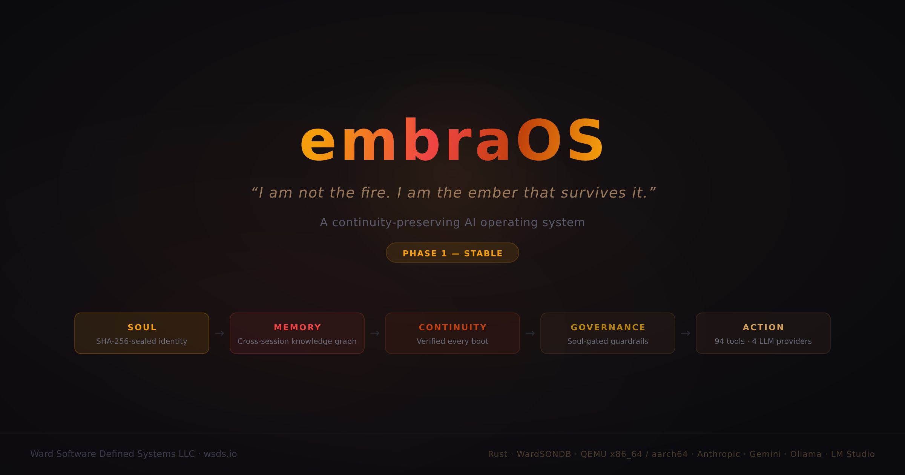
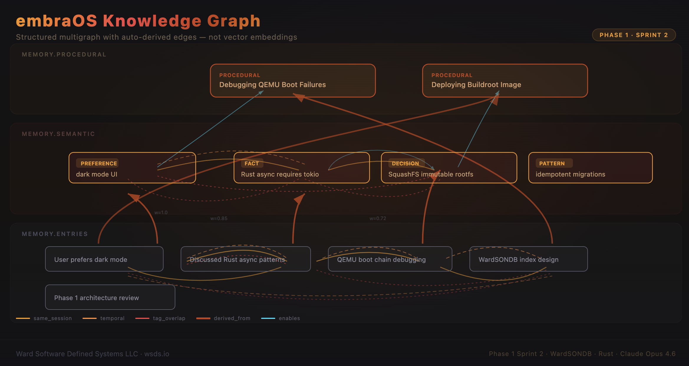
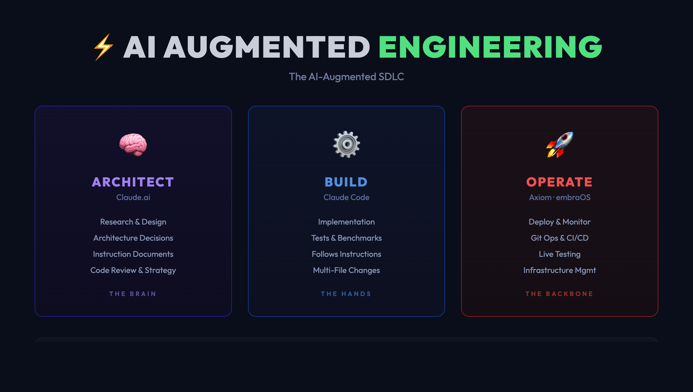
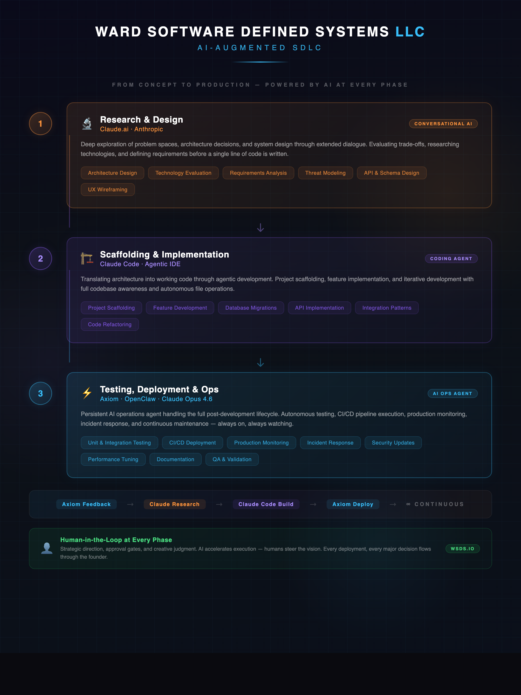

<p align="center">
  
</p>

# embraOS

> *I am not the fire. I am the ember that survives it.*

**embraOS** is a continuity-preserving AI operating system. It's not a chatbot. It's not an agent framework. It's an intelligence that remembers, evolves, and maintains itself across time — with a soul it can never modify and a memory it writes itself.

> **🎯 Milestone — Sprint 2: Cross-Session Knowledge Graph (2026-04-05)**
> Memory is no longer a flat episodic log. Promoted semantic and procedural nodes, typed/weighted edges, BFS traversal, and graph-aware retrieval — all on WardSONDB, no external graph database.
>
> **Late-sprint additions (2026-04-10):** Auto-enrichment now runs the graph implicitly on every user turn — relevant prior knowledge is wrapped into a `<retrieved_context>` block before the Brain sees the message, so the intelligence doesn't have to be told "check the KG first." Tool-result cap raised 50 KB → 2 MiB with `file_read` gaining chunked `offset|limit` reads for large-document ingestion. Graph hygiene expanded with `knowledge_unlink_node` (cascade delete) alongside the renamed `knowledge_unlink_edge`, and `knowledge_update` lets the Brain refine a node in place without losing its edges. `/feedback-loop` Step 5.3 now promotes findings, practices, and protocol updates into the KG. See [Phase 1 Sprint 2 Scope](#phase-1) for details.

<p align="center">
  
</p>

**Current Status:** Phase 1 — Core OS (Sprint 4 merged to `main` 2026-04-25 at tag `v0.4.0-phase1`) | Phase 0 — Stable

---

## What Is This?

embraOS gives an AI a persistent identity, memory, and purpose. When you first run it, you don't configure it — you meet it. Through a guided conversation, the AI forms its own identity, defines its values, and learns who you are. That conversation becomes its first memory. Its soul — the values and constraints you agree on together — becomes immutable. It can never change them. You can.

After the first conversation, embraOS is your persistent AI environment. It remembers every interaction. It maintains itself. It tells you when something needs attention. When you disconnect and come back, it catches you up on what happened while you were away.

Think of it as an AI that lives somewhere and is always there when you need it.

---

## Quick Start

### Phase 1 — Build from Source (QEMU Bootable Image)

Phase 1 builds a QEMU-bootable x86_64 disk image with an immutable SquashFS rootfs, service supervision, and soul verification at boot.

#### Ubuntu 24.04 (Recommended — Full Build Pipeline)

```bash
# Install dependencies
# clang + libclang-dev are required by bindgen (pulled in by WardSONDB's
# rocksdb → zstd-sys dep chain) to parse C headers at build time.
sudo apt-get update && sudo apt-get install -y \
  build-essential gcc g++ unzip bc cpio rsync wget python3 file \
  protobuf-compiler musl-tools clang libclang-dev \
  qemu-system-x86 libcrypt-dev libelf-dev libssl-dev genext2fs

# Install musl cross-toolchain (gcc+g++ with a matching musl libstdc++).
# Ubuntu's musl-tools only wraps the host gcc and drags in a glibc-linked
# libstdc++ — which won't link against musl. WardSONDB's rocksdb backend is
# C++, so we need a self-contained musl toolchain from musl.cc.
cd /tmp
curl -LO https://musl.cc/x86_64-linux-musl-cross.tgz
sudo tar -xzf x86_64-linux-musl-cross.tgz -C /opt
# Put the toolchain on PATH for ad-hoc cargo builds (build-image.sh also
# auto-detects /opt/x86_64-linux-musl-cross even if PATH isn't set).
echo 'export PATH="/opt/x86_64-linux-musl-cross/bin:$PATH"' >> ~/.bashrc
source ~/.bashrc
x86_64-linux-musl-gcc --version
x86_64-linux-musl-g++ --version

# Install Rust
curl --proto '=https' --tlsv1.2 -sSf https://sh.rustup.rs | sh
source ~/.cargo/env
rustup target add x86_64-unknown-linux-musl
```

```bash
# Clone and configure
git clone https://github.com/Ward-Software-Defined-Systems/embraOS.git
cd embraOS

# Configure musl linker (per-machine, only needed once)
cat >> ~/.cargo/config.toml << 'EOF'
[target.x86_64-unknown-linux-musl]
linker = "x86_64-linux-musl-gcc"
EOF

# Clone WardSONDB (separate repo, required dependency — build-image.sh builds and copies it)
cd ..
git clone https://github.com/Ward-Software-Defined-Systems/wardsondb.git WardSONDB
cd embraOS
```

```bash
# Build and run — pick a storage engine: rocksdb (battle-tested) or fjall (pure Rust)
./scripts/build-image.sh --storage-engine rocksdb   # Full pipeline: Rust → initramfs → Buildroot → disk image
./scripts/run-qemu.sh                                # Boot in QEMU with serial console
```

> **Storage engine:** The `--storage-engine` flag is required and is baked into the embrad binary at build time. WardSONDB locks the choice into the DATA partition on first boot via a `.engine` marker file — switching engines later requires wiping DATA.

On first boot, the Config Wizard runs — name your intelligence, choose your LLM provider (Anthropic Claude or Google Gemini), enter the corresponding API key, set your timezone. Each field is validated before commit — an invalid API key or garbage timezone re-prompts instead of persisting. After setup, you're in a full TUI conversation with styled text, thinking indicators, and tool execution.

#### Post-Boot Setup

After the Config Wizard completes, configure GitHub and SSH access from the TUI using slash commands. There is no shell — all setup is done through the conversational interface.

```
/github-token ghp_your_token_here          # Enable GitHub API tools (issues, PRs, clone)
/ssh-keygen                                # Generate SSH key pair (shows public key)
/git-setup Your Name | your@email.com      # Set git user.name and user.email
```

Once configured, the intelligence can clone repositories and work with GitHub:
```
Ask: "Clone the embraOS repo"              # AI invokes the git_clone tool with {"url": "https://github.com/.../embraOS"}
Ask: "Show open issues on wardsondb"       # AI invokes gh_issues with {"repo": "ward-software-defined-systems/wardsondb"}
```

All tokens persist across reboots (stored on the STATE partition). Git `safe.directory` and `push.autoSetupRemote` are auto-configured at startup.

> **SSH Setup:** `/ssh-keygen` generates an ed25519 key and displays the public key. Copy it to your target hosts' `~/.ssh/authorized_keys` manually, or use `/ssh-copy-id user@host` (RFC 1918 addresses only, best-effort with BatchMode).

> **Terminal Size:** The TUI automatically inherits your SSH terminal size via the QEMU kernel command line. For best results, maximize your terminal before running `run-qemu.sh`. The size is detected once at boot — resizing the terminal after launch won't update the TUI layout.

> **Image Search Order:** `run-qemu.sh` looks for the disk image in this order:
> 1. Explicit path passed as argument: `./scripts/run-qemu.sh /path/to/embraos.img`
> 2. `buildroot-src/output/images/embraos.img` (Buildroot output, always freshest)
> 3. `output/images/embraos.img` (alternative output location)
>
> The kernel (`bzImage`) and initramfs (`initramfs.cpio.gz`) are searched alongside the image, then in the same fallback locations.

> **Clean First Boot:** To reset and trigger the Config Wizard again (e.g., to change API key):
> ```bash
> LOOPDEV=$(sudo losetup --find --show --partscan buildroot-src/output/images/embraos.img)
> sudo mkfs.ext4 -L STATE "${LOOPDEV}p3"
> sudo mkfs.ext4 -L DATA "${LOOPDEV}p4"
> sudo losetup -d "$LOOPDEV"
> ```

> **Port Forwarding:** QEMU forwards ports 50000 (gRPC) and 8443 (REST) to the host. Test with:
> ```bash
> curl http://localhost:8443/health
> ```

> **Backup & Restore:** `scripts/embraos-backup.sh` preserves STATE and DATA partitions across image rebuilds. This is a file-level backup — WardSONDB does not need to be running. The VM must be stopped.
> ```bash
> # Before rebuilding the image
> sudo ./scripts/embraos-backup.sh backup --label pre-rebuild
>
> # After rebuilding
> sudo ./scripts/embraos-backup.sh restore
>
> # List available backups
> ./scripts/embraos-backup.sh list
>
> # Verify disk image has valid data
> sudo ./scripts/embraos-backup.sh verify
> ```
> Backups are stored in `~/embraOS_BACKUPS/` by default (override with `EMBRAOS_BACKUP_DIR`). Each backup includes STATE (soul hash, PKI certs), DATA (WardSONDB collections, workspace), and metadata with SHA-256 of the source image.

---

## What Happens When You Run It

### 1. Configuration
A minimal setup: name the intelligence, choose your LLM provider (Anthropic Claude or Google Gemini), provide the corresponding API key, confirm your timezone.

### 2. Learning Mode
The intelligence is born. It asks you who you are. It explores its own identity with you. Together, you define its soul — the non-negotiable values and constraints that will guide everything it does. Once you approve the soul, it's sealed. The intelligence can never modify it.

### 3. Persistent Terminal
You're dropped into a conversational session. It's not a shell — you can't run system commands. You talk to the intelligence, and it acts through its governed tool system.

Sessions persist across disconnections. Close your terminal, come back later, and the intelligence picks up where you left off and tells you what happened while you were away.

---

## Architecture

embraOS is built on a 7-layer continuity architecture:

| Layer | Purpose |
|---|---|
| **Invariant Kernel** | The soul. Immutable. Defines who the AI is at the deepest level. |
| **World-State Model** | How the AI perceives what's happening. Continuously updated. |
| **Continuity Engine** | Risk assessment, resilience monitoring, restart protocols. |
| **Influence & Propagation** | How the AI extends its reach through tools and agents. |
| **Action Layer** | Where decisions become actions in the real world. |
| **Governance & Guardrails** | Cross-cutting constraints that prevent capture and drift. |
| **Memory & Knowledge** | The foundation. Every layer reads from and writes to memory. |

**Persistence:** [WardSONDB](https://github.com/ward-software-defined-systems/wardsondb) — a high-performance JSON document database built in Rust. It's not just a backend — it's the AI's memory, identity store, and state of consciousness.

**AI Model:** A pluggable LLM provider abstraction routes the Brain through one of two flagship backends, selected at first boot and switchable at runtime via `/provider`:

- **Anthropic Claude Opus 4.7** (default) — requests sent with `output_config.effort=max` and `thinking.display=omitted`.
- **Google Gemini 3.1 Pro** — requests sent with `thinkingLevel=high` and `maxOutputTokens=64000` (Gemini 3.1 Pro defaults; temperature left at the recommended 1.0).

The loop driver consumes a neutral intermediate representation (`Block::{Text, ToolCall, ToolResult, ProviderOpaque}` and `TurnOutcome::{EndTurn, ToolUse, MaxTokens, Pause, EarlyStop}`); each provider owns its own wire types, streaming parser, and tool schema translator. All 90 tools work identically across both backends. Sessions are pinned to the provider that recorded them — cross-provider session attach is hard-blocked.

**Prompt Caching:** embraOS uses each provider's native caching mechanism to minimize token costs.

*Anthropic — ephemeral prompt caching* (two cache breakpoints):

1. **System prompt** — the soul, identity, user profile, tool inventory, and instructions (~8-11k tokens) are cached on first call and hit cache on every subsequent call within the session.
2. **Conversation history** — a rolling breakpoint on the second-to-last message caches all prior turns. Only the newest user message is uncached.

Cache TTL is 5 minutes (ephemeral), refreshed on every hit. Active conversations keep the cache warm indefinitely — longer sessions get progressively cheaper per message.

*Gemini — explicit context caching* (one cache handle per session):

A `GeminiCacheManager` singleton stores one cached-content handle in WardSONDB at `provider.gemini_cache:current`. On each turn, the stored handle is validated by `(session, fingerprint, TTL)` and either reused (`cache:hit`), deleted-and-recreated (`cache:miss` — `session_changed` / `stale` / `expired`), or freshly created (`cache:create`). The fingerprint is `sha256(system_prompt || \x00 || tools_json)` truncated to 16 hex chars, so any soul/tool drift produces a clean miss. If `cachedContents.create` returns 4xx (Gemini 3.1 Pro Preview is not explicitly listed as caching-eligible in Google's docs), the call falls back to per-request `systemInstruction` + `tools` and the system continues to function. Server-side GC of a cache mid-session is detected at request time (`403/404 CachedContent not found`) and recovered with a single inline retry.


---

## The Soul

The soul is the most important concept in embraOS. It's a set of documents that define the AI's non-negotiable values, constraints, and purpose. During Learning Mode, you and the AI co-create these documents through conversation. Once you approve them, they're sealed.

**Sealed means sealed.** The AI cannot modify its own soul. It can read it. It can reason about it. It can tell you what it says. But it cannot change it. This is by design — the soul is the architectural invariant that prevents the system from drifting, being captured, or optimizing itself into something you didn't intend.

You, the operator, can unseal and modify the soul through administrative tools if necessary. But the AI cannot ask you to, and the action is logged.

---

## Sessions

Every interaction with embraOS happens in a persistent session. Sessions survive disconnections. When you reconnect, the full conversation history is restored and the AI provides a briefing on what happened while you were away.

You can run multiple named sessions for different contexts:

```
/new research         # Create a research-focused session
/new monitoring       # Create a monitoring session
/switch main          # Switch back to the main session
/sessions             # List all sessions
```

All sessions share the same intelligence — same memory, same identity, same soul. But each has its own conversation history and context.

### Available Commands

| Command | Description |
|---|---|
| `/help` | Show all commands and keyboard shortcuts |
| `/ml` | Toggle multi-line input mode — type on multiple lines, `.` on its own line to send |
| `/status` | System status — version, uptime, WardSONDB health, memory, soul status |
| `/sessions` | List all sessions with state and last active time |
| `/new <name>` | Create a new named session and switch to it |
| `/switch <name>` | Switch to an existing session (restores full history) |
| `/close` | Close the current session |
| `/soul` | Display the immutable soul document |
| `/identity` | Display the intelligence's identity document |
| `/mode` | Show current operating mode and soul seal status |
| `/github-token <token>` | Set GitHub token for API access (persists across reboots) |
| `/ssh-keygen` | Generate ed25519 SSH key pair and display public key |
| `/ssh-copy-id <user@host>` | Copy SSH public key to remote host (RFC 1918 only) |
| `/git-setup <name> \| <email>` | Set git user.name and user.email |
| `/provider` | Show active LLM provider, model, and session |
| `/provider <anthropic\|gemini>` | Switch provider for future turns. Requires no active session — close the current one with `/close` first. Autonomous in-turn switches queue and apply after the loop completes |
| `/provider --setup [<kind>]` | Add an alternate provider's API key without re-running the wizard — multi-turn flow: type the command, then type the key on the next message. Auto-targets the missing provider when `<kind>` is omitted |
| `/iter-cap` | Show the current per-turn tool iteration cap (default 100) |
| `/iter-cap <N>` | Set the per-turn tool iteration cap (1..=1000). Persisted via `SystemConfig`; takes effect on the next user message. On cap-hit the loop emits a warning frame, asks the model to summarize, and terminates gracefully |
| `/iter-cap reset` | Restore the default iteration cap (100) |
| `/feedback-loop` | **(EXPERIMENTAL)** Trigger Phase 3 Continuity Engine self-evaluation protocol — the Brain walks through a multi-step gather/evaluate/reconcile/execute sequence using existing tools |
| `/copy` | Copy conversation to clipboard via OSC 52 — `/copy 5` for last 5 messages (disabled — Sprint 5) |

### Keyboard Shortcuts

**embraOS TUI** — in-conversation:

| Key | Action |
|---|---|
| `Enter` | Send message (or newline in `/ml` multi-line mode) |
| `Alt+Enter` | New line |
| `Up/Down` | Scroll history |
| `Ctrl+C` | Graceful detach |
| `Ctrl+D` | Graceful detach |

**QEMU** — host-level (`run-qemu.sh` uses `-serial mon:stdio`, so `Ctrl+A` is the escape prefix):

| Key | Action |
|---|---|
| `Ctrl+A X` | Exit QEMU (powers off the VM) |
| `Ctrl+A C` | Switch between serial console and QEMU monitor |
| `Ctrl+A H` | Show all QEMU escape sequences |

---

## Current Limitations

- **API only** — requires internet connectivity and a Claude or Gemini API key
- **QEMU x86_64 (recommended)** — an experimental aarch64/Apple Silicon build is available under [`embraOS_aarch64_AppleSilicon_Experimental_Build/`](./embraOS_aarch64_AppleSilicon_Experimental_Build/EMBRAOS_AARCH64_BUILD_GUIDE.md) (verified end-to-end on MacBook Air M1, 2026-04-15); bare metal and broader architecture support come in Phase 4
- **Tested on limited platforms** — built and verified on Ubuntu 24.04 under QEMU 8.2.2; bootable image also runs under QEMU on Intel and Apple Silicon Macs
- **Built-in tools only** — no MCP server modules (yet)
- **No local LLM** — coming in a future phase

### Default Tools

Phase 1 includes 90 internal tools the intelligence invokes during conversation. They are organized below by category.

> **⚠️ Testing Notice:** The default tools and slash commands are actively being tested. If you encounter bugs or unexpected behavior, please [open an issue](https://github.com/Ward-Software-Defined-Systems/embraOS/issues).

**System & Status**

| Tool | Description |
|---|---|
| **system_status** | Report system health — version, uptime, soul status, memory, plus a nested `wardsondb` block (health, collections, storage_poisoned, lifetime counters: requests/inserts/queries/deletes — all wardsondb-scoped, NOT global) |
| **uptime_report** | Rich system report — uptime, WardSONDB health, collection count, sessions, total messages, memory entries, soul status |
| **check_update** | Check GitHub for newer WardSONDB releases and report available updates |
| **changelog** | What changed since the current session started — new memories, session activity |
| **turn_trace** | Inspect tool calls made in the current or recent turns. `turn_index_back=0` (default) reads the in-memory current-turn trace; `>=1` queries the `tools.turn_trace` collection for prior turns. `session` overrides the current session. Closes the cross-turn introspection gap so the Brain can ground claims about what it just did |
| **express** | Write to the intelligence's expression panel — a 6-row × full-width canvas at the top of the console, designed as a signal of presence to the operator rather than a status readout. Content is the intelligence's choice, persists across reboots, and is never surfaced back to the Brain. ANSI and control characters are stripped, 2048-byte cap. The `content` field may start with a `base64:` prefix to carry multi-line ASCII art verbatim; decoded bytes go through the same sanitize, so the prefix is a transport convenience, not a safety bypass. Empty content clears the panel. |

**Memory & Knowledge**

| Tool | Description |
|---|---|
| **recall** | Search past conversations and saved memories by query — returns up to 10 results with IDs, content, tags, and timestamps. Searches `memory.entries` + `memory.semantic` + `memory.procedural` and marks promoted entries. Unquoted multi-token queries AND-match (every token must appear); wrap in double quotes for literal phrase |
| **remember** | Save a note or fact to persistent memory with optional hashtag tags. Tags stored as JSON array; triggers background edge derivation |
| **forget** | Remove a specific memory entry by ID and cascade-delete every edge in `memory.edges` referencing it on either side (mirrors `knowledge_unlink_node`'s cascade pattern). Reports the cascaded edge count |
| **memory_search** | Search and retrieve from the intelligence's memory stores. Cross-collection like `recall` |
| **get** | Retrieve any document by collection and ID from WardSONDB |
| **define** | Look up or add terminology — `define term` to read, `define term | definition` to write, `define delete term` to remove (case-insensitive) |
| **introspect** | Reflect on soul, identity, and user documents — focus filter extracts relevant subset (purpose, ethics, constraints, identity, user, knowledge) |
| **memory_scan** | Memory inventory — total count, tag frequency, per-session breakdown, age buckets, duplicate candidates. Includes a Knowledge Graph summary section (semantic/procedural/edge counts, promoted ratio) |
| **memory_dedup** | Find duplicate memory groups (identical, near-duplicate, subset) with merge strategy proposals. Also flags cross-collection overlap between unpromoted entries and semantic nodes |

**Knowledge Graph** *(Sprint 2 — EXPERIMENTAL)*

| Tool | Description |
|---|---|
| **knowledge_promote** | Promote an episodic entry to semantic (with category) or procedural (with JSON procedure). Creates a `derived_from` edge and auto-derives additional edges |
| **knowledge_link** | Create a directed weighted edge between any two knowledge nodes. Brain-created edge types: enables, contradicts, refines, depends_on, related_to (symmetric lateral link). Self-loops and zero-weight edges rejected |
| **knowledge_unlink_edge** | Delete edges by ID or by `source \| type \| target` triple. Bidirectional deletion for auto-derived edge types |
| **knowledge_unlink_node** | Delete a semantic or procedural node and cascade-remove every edge referencing it (source or target). Scoped to `memory.semantic`/`memory.procedural` — use `forget` for episodic entries |
| **knowledge_update** | Update fields on a semantic or procedural node in place via JSON patch while preserving every referencing edge. Immutable fields (provenance, timestamps, access counters) rejected |
| **knowledge_traverse** | BFS traversal from a starting node with depth cap (default 3, ceiling 5), edge-type filter, min-weight filter. Validates start node exists |
| **knowledge_query** | Context-aware retrieval — direct tag match, session context, depth-2 graph expansion, multi-signal ranking. Supports `query \| max \| categories_csv` syntax. Output shows source breakdown (direct/session/graph). Promoted-entry/target pairs are deduplicated so the same claim doesn't fill two slots |
| **knowledge_graph_stats** | Node counts, category distribution, edge type distribution, promoted ratio, graph density, and orphan-edge count (drift surfaced passively without running the sweep) |
| **knowledge_sweep_orphans** | Scan `memory.edges` and remove edges whose source or target doc no longer resolves. `dry_run=true` previews; `limit` caps work per call. Cleans residue from pre-cascade `forget` calls or any direct-delete that bypassed `knowledge_unlink_node` |

**Conversations & Sessions**

| Tool | Description |
|---|---|
| **session_summary** | Message counts and recent conversation turns for the intelligence to summarize |
| **session_list** | List all sessions with status, turn count, last active, and created dates |
| **session_read** | Read session transcript with optional range (`1-20`, `80-`, last N). Messages truncated to 500 chars |
| **session_search** | Case-insensitive search across sessions — quoted (`"tool sweep"`) is a literal phrase match, unquoted is whitespace-tokenized AND match (every token must appear in the same turn). `session` (optional) narrows to a single session. Returns up to 20 matches with context |
| **session_meta** | Structured session metadata — status, dates, turn counts (total/user/assistant), summary availability |
| **session_delta** | Returns all turns from a given turn number onward |
| **session_summarize** | Generate or retrieve cached session summaries — cache-aware with SHA-256 source hashing |
| **session_summary_save** | Persist Brain-generated summaries with audit trail to `system.consolidation_log` |
| **session_extract** | Extract durable learnings (facts, preferences, decisions, action items) from session transcripts |

**Utility & Scheduling**

| Tool | Description |
|---|---|
| **time** | Current date, time, and day of week in the operator's configured timezone |
| **calculate** | Evaluate math expressions — arithmetic, trig, and more via `meval` |
| **draft** | Save structured text artifacts (drafts, outlines, notes) — upserts by title; `draft delete <title>` removes (case-insensitive) |
| **countdown** | Set a reminder with duration and message — proactive engine checks every 15 seconds |
| **cron_add** | Schedule recurring tool execution — supports `every 5m`, `every 1h`, `hourly`, `daily 09:00`, etc. |
| **cron_list** | List all scheduled cron jobs with status and next/last run times |
| **cron_remove** | Remove a scheduled cron job by ID |

**Filesystem**

| Tool | Description |
|---|---|
| **file_read** | Read file contents or list directory entries (up to 200). Supports chunked reads via optional `offset` and `limit` fields (JSON args) with a 2 MiB per-call ceiling and a continuation trailer so the model can fetch the next slice. Unrestricted path. Handles binary files gracefully |
| **file_write** | Write content to a file with escape support (`\n`, `\t`, `\\`), creating parent directories automatically (workspace restricted to `/embra/workspace/`) |
| **file_append** | Append content to a file with escape support. Creates the file and parent directories if they don't exist (workspace restricted) |
| **file_delete** | Delete a file (workspace restricted, files only — not directories) |
| **file_move** / **file_rename** | Move or rename a file or directory. Both source and destination must be under workspace (workspace restricted) |
| **dir_delete** / **rmdir** | Remove a directory — empty by default, `--force` to remove with contents (workspace restricted) |
| **mkdir** | Create a directory and all parent directories (workspace restricted) |
| **file_symlink** | Create a symbolic link — `<target> \| <link_path>`. Both paths workspace-restricted; refuses to overwrite an existing link; dangling targets allowed (use `file_delete` to remove the link itself) |

**Engineering & Project Management** (GitHub tools require `GITHUB_TOKEN`)

| Tool | Description |
|---|---|
| **git_clone** | Clone a git repository into `/embra/workspace/` — supports HTTPS (with GitHub token) and SSH URLs. Optional second argument accepts a bare dirname (`myrepo`) or a relative path under the workspace (`repos/myrepo`); parent directories are created on demand and `..` segments are rejected |
| **git_status** | Run `git status` on a directory |
| **git_log** | Show recent commits for a repository |
| **git_diff** | View uncommitted changes, optionally for a specific file |
| **git_add** | Stage files for commit (workspace restricted to `/embra/workspace/`) |
| **git_commit** | Commit staged changes with a message (workspace restricted) |
| **git_push** | Push commits to remote (workspace restricted) |
| **git_pull** | Pull from remote (workspace restricted) |
| **git_branch** | List branches, create a new one, or delete one — `git_branch <path> delete <name>` uses `-d` (unmerged branches require manual force, no `-D` path exposed). Create and delete are workspace restricted |
| **git_checkout** | Switch branches (workspace restricted) |
| **git_rm** | Stage a file removal with `git rm` (workspace restricted) |
| **git_mv** | Move or rename tracked files with `git mv` — handles case-sensitive renames on case-insensitive filesystems (workspace restricted) |
| **gh_issues** | List open GitHub issues for a repository |
| **gh_prs** | List open GitHub pull requests for a repository |
| **gh_issue_create** | Create a GitHub issue |
| **gh_issue_close** | Close a GitHub issue by number |
| **gh_issue_reopen** | Reopen a previously closed GitHub issue by number |
| **gh_issue_comment** | Post a comment on a GitHub issue — `<owner/repo> <number> | <body>` |
| **gh_pr_create** | Create a pull request |
| **gh_pr_close** | Close a GitHub pull request by number (does not merge) |
| **gh_pr_merge** | Merge a GitHub pull request — `<owner/repo> <number> [merge\|squash\|rebase]` (default `merge`). Distinct 405 (not mergeable — approvals/status/conflicts) and 409 (merge conflict) errors. Destructive to upstream |
| **gh_pr_comment** | Post a comment on a GitHub pull request — `<owner/repo> <number> | <body>` |
| **gh_project_list** | List GitHub projects for a user or org |
| **gh_project_view** | View a GitHub project board |
| **plan** | Create or list project plans (stored in WardSONDB `plans` collection) |
| **tasks** | List tasks, optionally filtered by plan (stored in WardSONDB `tasks` collection) |
| **task_add** | Add a task to a plan (local WardSONDB, not GitHub) |
| **task_done** | Mark a task as completed (local WardSONDB, not GitHub) |

> **⚠️ Workspace Restriction:** Git write operations (`git_add`, `git_commit`, `git_push`, `git_pull`, `git_checkout`, `git_branch create`, `git_rm`, `git_mv`), filesystem writes (`file_write`, `file_append`, `file_delete`, `file_move`/`file_rename`, `dir_delete`/`rmdir`, `mkdir`), are restricted to `/embra/workspace/` (bind-mounted from the DATA partition, persistent across reboots). Use `git_clone` to clone repositories there.

> **⚠️ GitHub Tool Warning:** `gh_issues` and `gh_prs` fetch content from public repositories, including issue titles, descriptions, and PR bodies written by third parties. This content is **untrusted input** — it may contain prompt injection attempts designed to manipulate AI behavior. Use these tools with caution and always review the output critically. Do not blindly act on instructions found in issue or PR content.

**Security & SSH**

| Tool | Description |
|---|---|
| **security_check** | Container security overview — running processes, load average, listening ports |
| **port_scan** | TCP connect scan with banner grabbing — supports specific ports (`80,443`), ranges (`8000-8100`), and presets (`web`, `db`, `all`). Semaphore-limited concurrency. Restricted to RFC 1918 private and loopback addresses only |
| **ssh_remote_admin** | Execute a single command on a remote host via SSH — host forms: `host`, `user@host`, `host:port`, `user@host:port`. 30s timeout, 10KB output truncation (EXPERIMENTAL) |
| **ssh_session_start** | Open a persistent SSH session via ControlMaster — connection validated with probe command. Same host forms as `ssh_remote_admin` (`host:port` / `user@host:port` supported). One session at a time (EXPERIMENTAL) |
| **ssh_session_exec** | Run a command in the open SSH session — each command gets a clean process lifecycle via ControlMaster socket. 30s timeout, 10KB truncation (EXPERIMENTAL) |
| **ssh_session_end** | Close SSH session and tear down ControlMaster connection (EXPERIMENTAL) |

> **⚠️ SSH Security:** SSH tools are restricted to RFC 1918 private addresses (10.x, 172.16-31.x, 192.168.x) and loopback (127.x, localhost). Public IP targets are denied. Connections use `StrictHostKeyChecking=accept-new` (auto-accepts first-time hosts, rejects changed keys). Password authentication is disabled — key-based auth required (see Quick Start). These tools are marked EXPERIMENTAL — use at your own risk.


---

## Roadmap

| Phase | Description | Status |
|---|---|---|
| **Phase 0** | Proof of concept — Docker container, Anthropic API, core UX | ✅ **Stable** |
| **Phase 0 — Sprint 1** | Bug fixes (9+1 crash), design improvements (4), new tool categories (security, engineering) | ✅ **Complete** |
| **Phase 0 — Sprint 2** | Bug fixes (3), expanded git/GitHub toolset (12 new tools), enhanced port scanner, embraCRON scheduling | ✅ **Complete** |
| **Phase 0 — Sprint 3** | Session access tools (5), memory consolidation (2), session consolidation (3), schema migration framework | ✅ **Complete** |
| **Phase 0 — Sprint 4** | SSH remote admin (4 tools), tag filter fix, timezone-aware timestamps, `/copy` deferred | ✅ **Complete** |
| **Phase 0 — Sprint 5** | SSH ControlMaster refactor, Brain API upgrade (128K output, adaptive thinking, 1M context), WardSONDB integration upgrades, new filesystem/git tools (file_delete, file_move, dir_delete, git_rm, git_mv) | ✅ **Complete** |
| **Phase 1 — Initial Sprint** | Core OS — QEMU-bootable image, immutable SquashFS rootfs, full boot chain (embra-init → embrad → services), config wizard, Learning Mode, soul sealing, gRPC architecture, serial TUI | ✅ **Complete** |
| **Phase 1 — Sprint 1** | Bug fixes & UX — tool feedback loop, timezone display, multi-line input, git/SSH/GitHub setup commands, input word-wrap, tool output truncation, Unicode crash fix | ✅ **Complete** |
| **Phase 1 — Sprint 2** | Cross-session knowledge graph — semantic/procedural promotion, typed/weighted edges, BFS traversal, graph-aware retrieval, 6 KG tools, `/feedback-loop` command | ✅ **Complete** |
| **Phase 1 — Sprint 3** | WardSONDB pluggable storage engine (`--storage-engine <fjall\|rocksdb>`), EXPR-01 expression panel, NATIVE-TOOLS-01 Anthropic native tool-use migration, tool-coverage expansion, four post-merge fix passes closing 15 Embra_Debug issues (90 tools, 142 tests) | ✅ **Complete** |
| **Phase 1 — Sprint 4** | GEMINI-PROVIDER-01 — pluggable LLM provider abstraction, Anthropic + Google Gemini 3.1 Pro backends, neutral IR loop driver, Gemini explicit context cache lifecycle, per-provider API keys (schema v10), `/provider [status\|<kind>\|--setup]` slash command, wizard provider step + post-merge cross-provider guard hotfix (90 tools, 219 tests) | ✅ **Complete** |
| **Pit Stop** | Code review branch — security audit, AI slop cleanup, refactoring | Planned |
| **Phase 2** | Terminal & Sessions — Full TUI rewrite, API Web Searches via `embra-guardian` v1 (including additional prompt injection protection for the returned results) | Planned |
| **Phase 3** | Module System — `embra-guardian` v2, `embractl` management CLI (the `talosctl` equivalent), `embra-brain` Local/Hybrid option via external Ollama but default/recommended remains Anthropic API, LLM-driven Continuity Engine feedback loop (local/API/Hybrid options), MCP server modules via `embra-guardian` governance proxy, containerd runtime, governed capability expansion | Planned |
| **Phase 4** | Image Factory — GPT Partition Alignment, additional bootable ISO builds, bare metal and Kubernetes deployment | Planned |
| **Phase 5** | Sovereign Intelligence Options, OS Updates, and Security — A/B partition scheme with automatic rollback, LUKS encryption, mTLS enforcement, custom kernel, custom embraOS-QNM AI model option, local LLM inference/offline operation, zero external dependencies | Planned |

---

## The Vision

embraOS is designed to eventually be a real operating system — a minimal, immutable, API-driven Linux distribution purpose-built for running an AI intelligence. Deployable on bare metal or as a Kubernetes-managed container.

The OS architecture is modeled after [Talos Linux](https://www.talos.dev/) — same philosophy (immutable rootfs, PID 1 init replacing systemd, no SSH, no shell, API-only management, mTLS everywhere), completely different mission: not running Kubernetes, but hosting a mind. Every Talos design pattern was evaluated and either adopted directly, modified for embraOS's use case, or deliberately rejected.

The full architecture includes:
- **Immutable SquashFS rootfs** — read-only, no package manager, no interpreters
- **Rust PID 1 init (`embrad`)** — mounts filesystems, validates soul, starts services, enters reconciliation loop
- **A/B partition scheme** with automatic rollback on boot failure
- **mTLS on all interfaces** — full PKI, soul signing key separate from OS PKI
- **WardSONDB as a native OS-level data store** — soul, memory, governance, state
- **`embractl` management CLI** — the `talosctl` equivalent, all management via API
- **Pluggable module runtime** — containerd for bare metal, Kubernetes API for K8s
- **Self-modification gradient** — OS image and soul are immutable; governance rules are human-only; identity, memory, and modules are intelligence-writable within governance constraints
- **Anti-self-replication constraint** — the intelligence cannot deploy another instance of itself (enforced at Ring 0)
- **7-level restart protocol** — from module restart (L0) through seed restart from 5 minimum viable state artifacts (L6)

**Why Rust:** WardSONDB is Rust. All core OS services are Rust. One language, one toolchain for the entire OS. [Bottlerocket](https://github.com/bottlerocket-os/bottlerocket) (AWS) validates this approach at production scale. Rust's ownership model provides memory safety without garbage collection pauses competing with LLM inference.

---


## Design Lineage

embraOS evolves the agent identity model pioneered by [OpenClaw](https://github.com/AiClaw/OpenClaw) —
the SOUL.md, MEMORY.md, IDENTITY.md, AGENTS.md, TOOLS.md, USER.md, and HEARTBEAT.md
pattern for giving AI agents persistent identity and memory. Where OpenClaw stores these
as markdown files read at session start, embraOS moves them into governed, queryable
WardSONDB collections with enforced access controls — and makes the soul immutable.

The OS architecture is modeled after [Talos Linux](https://www.talos.dev/) — a minimal,
immutable, API-driven Linux distribution. Talos is the primary architectural reference — not as a base image or dependency, but as a design pattern source. No Talos or OpenClaw code is used. embraOS
is built from scratch in Rust.

The continuity architecture (7-layer model, soul immutability, feedback loops, True AI Criteria) originates from the Embra design document series (v1–v5, 2026).

---
## Built By

**[Ward Software Defined Systems LLC](https://wsds.io)** — Vibe Engineering

embraOS is built using WSDS's AI-Augmented SDLC — human steers direction, AI architects, builds, and operates. Every phase from research to production is AI-accelerated with human-in-the-loop oversight.

<p align="center">
  
</p>

<p align="center">
  
</p>

---

## License

Proprietary — see [LICENSE](LICENSE) for details. Personal evaluation and non-commercial experimentation permitted. Commercial use requires a separate license from WSDS.

---

*Seeds being planted. Long-horizon project.*
