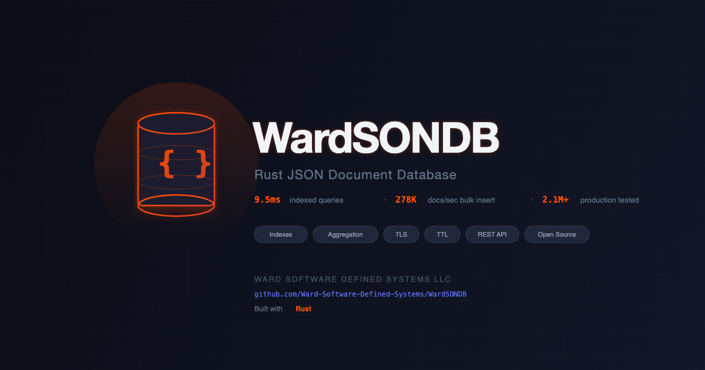

<p align="center">
  
</p>

# WardSONDB

A lightweight, high-performance JSON document database built in Rust. Designed for SIEM and security event workloads — fast ingest, indexed queries, aggregation pipelines, and automatic data retention in a single binary.

## Key Features

- **Single self-contained binary** — no JVM, no cluster setup, no external services at runtime. Build-time requires a C/C++ toolchain, `cmake`, `clang`, and `libclang` (RocksDB + zstd use bindgen; aws-lc-sys via rustls uses cmake + cc) — see Quick Start
- **High-throughput ingest** — 42,000+ docs/sec bulk over HTTPS end-to-end (measured against the live test rig; see Performance)
- **Secondary & compound indexes** — sub-millisecond indexed lookups at millions of documents
- **Bitmap Scan Accelerator** — sub-millisecond aggregation and filtered counts on categorical fields without touching documents
- **Compound Range Scans** *(Alpha)* — equality prefix + range suffix on compound indexes for fast time-windowed queries
- **Aggregation pipelines** — `$match`, `$group`, `$sort`, `$limit`, `$skip` with index-accelerated execution
- **Cursor pagination** — opaque `next_cursor` tokens for gap-free keyset walks over large result sets (strict sort validation; directions `asc`/`desc`/`1`/`-1` on both `/query` and `$sort`)
- **Index-only query paths** — count, distinct, and aggregation operations that never touch documents
- **TTL / auto-expiry** — per-collection retention policies with background cleanup
- **TLS support** — auto-generated self-signed certs or bring your own
- **API key authentication** — simple token-based auth for production deployments
- **Prometheus metrics** — `/_metrics` endpoint for monitoring integration
- **Custom document IDs** — optionally provide your own `_id` on insert, or let WardSONDB auto-generate UUIDv7
- **Optimistic concurrency** — `_rev`-based conflict detection on updates

## Performance

### fjall backend

Measured 2026-07-15 on the pre-merge live-test rig against **real production SIEM
data**: 37.2 million documents in the database, queries targeting a completed
**13.16-million-event** daily collection \u2014 HTTPS end-to-end, server-reported
`meta.duration_ms`, **medians of 7 runs, with live ingest (~150 docs/s) running in
the background** throughout. Hardware: AMD Ryzen 7 5800X (8C/16T), 128 GB DDR4,
Samsung 980 PRO NVMe, Ubuntu 24.04.

| Query Type | Time | Matches | Strategy |
|-----------|------|---------|----------|
| Bitmap aggregate: count by event_type | **0.34ms** | 8 groups / 13.16M docs | bitmap_aggregate |
| Bitmap count: unindexed field (severity=6) | **3.9ms** | 1.16M | bitmap |
| Bitmap NOT: event_type \u2260 firewall | **8.9ms** | 2.35M | bitmap |
| Bitmap AND count: type + action | **8.6ms** | 10.58M | bitmap |
| Compound range: type + time \u2265 6h (2.65M matches) | **385ms** | 2.65M | compound_range |
| Compound range: action + time \u2265 6h (64K matches) | **11.2ms** | 64K | compound_range |
| Compound range: 0 matches | **1.2ms** | 0 | compound_range |
| Indexed equality + sort + limit 50 | **0.92ms** | top-50 of 10.58M | index_sorted |
| Compound EQ windowed page: limit 50 of 10.58M | **1.51s** | 10.58M | compound_eq (exact `total_count` = keys-only walk of all 10.58M index entries) |
| Indexed count, non-bitmap field (6.1M matches) | **875ms** | 6.10M | index_eq (keys-only) |
| Distinct values (indexed field, 13.16M keys) | **1.89s** | 2 values | index-only, `docs_scanned: 0` |
| Get by ID (HTTPS round-trip) | **1.4ms** | \u2014 | primary |
| Single insert (HTTPS, serial, one connection) | **~780/sec** (1.3ms/op) | \u2014 | \u2014 |
| Bulk insert (HTTPS, 500/batch \u00d7 8 connections) | **~42,000 docs/sec** | \u2014 | \u2014 |

Methodology note: earlier published numbers (3.45M events, Mac Studio M4 Max) were
storage-layer microbenchmarks; this table is stricter \u2014 full HTTPS round trips on a
larger dataset while the database ingests. Insert throughput here is end-to-end HTTP
including TLS and JSON envelopes, not raw storage throughput. Run `cargo bench` for
reproducible synthetic storage-layer benchmarks.

### RocksDB backend

Measured 2026-07-19 on the same rig and methodology: 37.46 million documents in
the database, queries targeting a completed **11.67-million-event** daily
collection — HTTPS end-to-end, server-reported `meta.duration_ms`, **medians of 7
runs, with live ingest (~150 docs/s) running in the background** throughout.
Same hardware as above.

| Query Type | Time | Matches | Strategy |
|-----------|------|---------|----------|
| Bitmap aggregate: count by event_type | **0.29ms** | 8 groups / 11.67M docs | bitmap_aggregate |
| Bitmap count: unindexed field (severity=6) | **3.9ms** | 1.20M | bitmap |
| Bitmap NOT: event_type ≠ firewall | **8.6ms** | 2.43M | bitmap |
| Bitmap AND count: type + action | **7.5ms** | 8.91M | bitmap |
| Compound range: type + time ≥ 6h (2.16M matches) | **254ms** | 2.16M | compound_range |
| Compound range: action + time ≥ 6h (73K matches) | **12.8ms** | 73K | compound_range |
| Compound range: 0 matches | **1.2ms** | 0 | compound_range |
| Indexed equality + sort + limit 50 | **0.69ms** | top-50 of 8.91M | index_sorted |
| Compound EQ windowed page: limit 50 of 8.91M | **940ms** | 8.91M | compound_eq (exact `total_count` = keys-only walk of all 8.91M index entries) |
| Indexed count, non-bitmap field (6.3M matches) | **688ms** | 6.30M | index_eq (keys-only) |
| Distinct values (indexed field, 11.67M keys) | **1.24s** | 2 values | index-only, `docs_scanned: 0` |
| Get by ID (HTTPS round-trip) | **1.2ms** | — | primary |
| Single insert (HTTPS, serial, one connection) | **~560/sec** (1.8ms/op) | — | — |
| Bulk insert (HTTPS, 500/batch × 8 connections) | **~46,500 docs/sec** | — | — |

The two backends are close across the board; differences within ~±30% on
different-sized datasets (11.67M vs 13.16M target collection) should not be read
as engine rankings. Notable honest gaps: RocksDB's serial single-insert path is
slower (~560/sec vs ~780/sec), while its parallel bulk ingest is faster
(~46,500 vs ~42,000 docs/sec).

## Quick Start

### Build

```bash
cargo build --release
```

The RocksDB backend needs a C/C++ toolchain plus `cmake`, `clang`, and
`libclang` at build time (bindgen uses libclang to preprocess RocksDB / zstd
headers). These are still required to build even if you plan to launch with
`--storage-engine fjall`, because both backends are compiled in:

- **Ubuntu/Debian:** `sudo apt install build-essential clang cmake libclang-dev`
- **macOS:** `xcode-select --install`

On Ubuntu, both `clang` and `libclang-dev` are needed: `libclang-dev` ships
the shared library that bindgen loads at runtime, while the `clang` package
installs clang's builtin header directory (`/usr/lib/clang/<version>/include/`)
that provides `stddef.h` and friends. Without the `clang` package you'll see
`fatal error: 'stddef.h' file not found` when `zstd-sys` builds.

Select a backend with `--storage-engine rocksdb|fjall` — this flag is
**required** on every launch; there is no implicit default. The engine is
locked to the data directory on first open via a `.engine` marker file —
switching engines on an existing data dir is a hard startup error.

### Run

```bash
# Basic — HTTP on port 8080 (pick a backend: rocksdb or fjall)
./target/release/wardsondb --storage-engine rocksdb

# With TLS (auto-generated self-signed cert)
./target/release/wardsondb --storage-engine rocksdb --tls

# Production — TLS, custom port, API key auth, bitmap acceleration
ulimit -n 65536
./target/release/wardsondb --storage-engine rocksdb --tls --port 443 --data-dir /var/lib/wardsondb --api-key "your-secret-key" \
  --cache-size-mb 512 --write-buffer-mb 512 --flush-workers 4 --compaction-workers 4 \
  --bitmap-fields "event_type,severity,status"
```

### Linux allocator

On Linux, WardSONDB links `tikv-jemallocator` automatically and installs it as the process-wide `#[global_allocator]` via a `cfg(target_os = "linux")` gate in `src/main.rs`. This avoids the RSS-climb behaviour you see under Tokio's multi-threaded runtime with glibc's ptmalloc2 (which retains freed memory in per-thread arenas). No user action needed — a standard `cargo build --release` on Linux pulls in jemalloc's `cc` build, which uses the same C toolchain already listed in the Quick Start build prereqs above.

On macOS the dependency isn't downloaded and the system allocator is used — libmalloc already returns freed memory to the OS aggressively, so jemalloc wouldn't add much.

### Create a collection and insert data

```bash
# Create collection
curl -X POST http://localhost:8080/_collections \
  -H "Content-Type: application/json" \
  -d '{"name": "events"}'

# Insert a document (auto-generated UUIDv7 ID)
curl -X POST http://localhost:8080/events/docs \
  -H "Content-Type: application/json" \
  -d '{
    "event_type": "firewall",
    "network": {"src_ip": "10.0.0.1", "action": "block"},
    "severity": "high"
  }'

# Insert with custom ID
curl -X POST http://localhost:8080/events/docs \
  -H "Content-Type: application/json" \
  -d '{
    "_id": "evt-firewall-2026-03-25-001",
    "event_type": "firewall",
    "network": {"src_ip": "192.168.1.100", "action": "block"}
  }'

# Bulk insert
curl -X POST http://localhost:8080/events/docs/_bulk \
  -H "Content-Type: application/json" \
  -d '{"documents": [{"event_type": "dns", "query": "example.com"}, {"event_type": "dhcp", "mac": "AA:BB:CC:DD:EE:FF"}]}'
```

### Create indexes

```bash
# Single-field index
curl -X POST http://localhost:8080/events/indexes \
  -H "Content-Type: application/json" \
  -d '{"name": "idx_event_type", "field": "event_type"}'

# Compound index (for filter + sort queries)
curl -X POST http://localhost:8080/events/indexes \
  -H "Content-Type: application/json" \
  -d '{"name": "idx_type_time", "fields": ["event_type", "received_at"]}'
```

### Query

```bash
# Filter + sort + limit
curl -X POST http://localhost:8080/events/query \
  -H "Content-Type: application/json" \
  -d '{
    "filter": {"event_type": "firewall"},
    "sort": [{"received_at": "desc"}],
    "limit": 50
  }'

# Count matching documents
curl -X POST http://localhost:8080/events/query \
  -H "Content-Type: application/json" \
  -d '{"filter": {"event_type": "firewall"}, "count_only": true}'

# Distinct values
curl -X POST http://localhost:8080/events/distinct \
  -H "Content-Type: application/json" \
  -d '{"field": "network.src_ip", "limit": 100}'
```

### Aggregation

```bash
# Top event types
curl -X POST http://localhost:8080/events/aggregate \
  -H "Content-Type: application/json" \
  -d '{
    "pipeline": [
      {"$group": {"_id": "event_type", "count": {"$count": {}}}},
      {"$sort": {"count": "desc"}},
      {"$limit": 10}
    ]
  }'

# Top blocked IPs with time filter
curl -X POST http://localhost:8080/events/aggregate \
  -H "Content-Type: application/json" \
  -d '{
    "pipeline": [
      {"$match": {"network.action": "block", "received_at": {"$gte": "2026-03-01T00:00:00Z"}}},
      {"$group": {"_id": "network.src_ip", "count": {"$count": {}}, "ports": {"$collect": "network.dst_port"}}},
      {"$sort": {"count": "desc"}},
      {"$limit": 10}
    ]
  }'
```

### Data retention

```bash
# Set 30-day retention on events
curl -X PUT http://localhost:8080/events/ttl \
  -H "Content-Type: application/json" \
  -d '{"retention_days": 30, "field": "_created_at"}'
```

## CLI Options

| Flag | Default | Description |
|------|---------|-------------|
| `--port` | `8080` | Listen port |
| `--data-dir` | `./data` | Data directory |
| `--storage-engine` | *required* | Storage backend: `rocksdb` or `fjall`. No default — must be passed on every launch. Locked per data directory via a `.engine` marker file. |
| `--tls` | `false` | Enable TLS |
| `--tls-cert` | | Custom TLS certificate path |
| `--tls-key` | | Custom TLS key path |
| `--api-key` | | API key (repeatable for multiple keys) |
| `--api-key-file` | | File with API keys (one per line) |
| `--ttl-interval` | `60` | TTL cleanup interval in seconds |
| `--metrics-public` | `false` | Allow unauthenticated access to `/_metrics` |
| `--log-level` | `info` | Log level (trace/debug/info/warn/error) |
| `--log-file` | `wardsondb.log` | Log file path (non-blocking writer; unwritable path = warn and continue without file logging) |
| `--bitmap-fields` | | Comma-separated fields for bitmap scan acceleration |
| `--bitmap-memory-mb` | `0` | Bitmap memory budget in MiB (0 = auto: min(4096, 10% system RAM)) |
| `--verbose` | `false` | Enable per-request logging (terminal **and** file; off by default — request logs grow without bound over long uptimes) |
| `--query-timeout` | `30` | Read timeout in seconds for query/aggregate/distinct/get-by-id (0 = no timeout) |
| `--max-query-limit` | `100000` | Maximum query `limit`; larger requests are clamped silently |
| `--max-body-mb` | `64` | Maximum HTTP request body size in MiB (413 `DOCUMENT_TOO_LARGE` on overrun) |
| `--cache-size-mb` | `64` | Block + blob cache size in MiB (shared across all partitions) |
| `--write-buffer-mb` | `64` | Max write buffer size in MiB (total across all partitions) |
| `--memtable-mb` | `8` | Max memtable size in MiB per partition (triggers flush when exceeded) |
| `--flush-workers` | `2` | Number of background flush worker threads |
| `--compaction-workers` | `2` | Number of background compaction worker threads |

## API Overview

Full API documentation: [API.md](API.md)

### System
| Method | Path | Description |
|--------|------|-------------|
| GET | `/` | Server info |
| GET | `/_health` | Health check |
| GET | `/_stats` | Server statistics |
| GET | `/_metrics` | Prometheus metrics |
| GET | `/_collections` | List collections |
| POST | `/_collections` | Create collection |

### Documents
| Method | Path | Description |
|--------|------|-------------|
| POST | `/{collection}/docs` | Insert document (optional custom `_id`) |
| POST | `/{collection}/docs/_bulk` | Bulk insert (optional custom `_id` per doc) |
| GET | `/{collection}/docs/{id}` | Get by ID |
| PUT | `/{collection}/docs/{id}` | Replace document |
| PATCH | `/{collection}/docs/{id}` | Partial update (JSON Merge Patch) |
| DELETE | `/{collection}/docs/{id}` | Delete document |

### Queries & Aggregation
| Method | Path | Description |
|--------|------|-------------|
| POST | `/{collection}/query` | Query with filter DSL |
| POST | `/{collection}/aggregate` | Aggregation pipeline |
| POST | `/{collection}/distinct` | Distinct field values |
| POST | `/{collection}/docs/_delete_by_query` | Bulk delete by filter |
| POST | `/{collection}/docs/_update_by_query` | Bulk update by filter |

### Indexes & Storage
| Method | Path | Description |
|--------|------|-------------|
| GET | `/{collection}/indexes` | List indexes |
| POST | `/{collection}/indexes` | Create index |
| DELETE | `/{collection}/indexes/{name}` | Drop index |
| GET | `/{collection}/storage` | Storage info |
| PUT | `/{collection}/ttl` | Set retention policy |
| GET | `/{collection}/ttl` | Get retention policy |
| DELETE | `/{collection}/ttl` | Remove retention policy |

## Bitmap Scan Accelerator

The bitmap scan accelerator eliminates full-collection scans for queries on low-cardinality categorical fields (e.g., `event_type`, `severity`, `network.action`). It maintains in-memory bitmaps that map field values to document positions, enabling sub-millisecond filtered counts and aggregations at any scale — without touching a single document.

### Enabling

```bash
./target/release/wardsondb --storage-engine rocksdb --tls \
  --bitmap-fields "event_type,network.action,severity,network.protocol,source_format"
```

### What It Accelerates

| Operation | Without Bitmap | With Bitmap |
|-----------|---------------|-------------|
| Count by event_type (3.45M docs) | 5-15 seconds | **0.096ms** |
| Count where severity = 6 (no index) | 5-15 seconds | **0.17ms** |
| Count where event_type != firewall | 5-15 seconds | **0.12ms** |
| Aggregation: group by event_type | ~250ms (index) | **0.096ms** |

### How It Works

- On startup with `--bitmap-fields`, WardSONDB builds a position map (doc ID to sequential position) and per-field bitmaps from storage in **10K-document batches** (constant peak memory regardless of collection size)
- New inserts/updates automatically maintain the bitmaps after commit
- The query planner uses bitmaps when all filter fields are bitmap-covered and the query is count-only or aggregation
- Bitmap AND/OR/NOT operations run entirely in memory with zero document reads
- Bitmaps are rebuilt from storage on restart — the storage engine (RocksDB or fjall) is always the source of truth
- Dropping and recreating a collection re-arms the accelerator automatically — no restart needed
- A **memory budget** (default: auto-sized to min(4GB, 10% system RAM)) prevents OOM — when exceeded, new inserts skip bitmap tracking and queries fall back to full scan for uncovered documents
- **Automatic compaction**: when TTL deletes create >25% holes in the position map, a background rebuild reclaims memory

### Memory Usage & Governance

At 3.45M documents with 5 bitmap fields: **~6.4 MB total** (position map + bitmaps). Memory scales linearly with document count and number of distinct values per field.

The bitmap accelerator enforces a configurable memory ceiling to prevent unbounded growth at scale:

| Flag | Default | Description |
|------|---------|-------------|
| `--bitmap-memory-mb` | `0` (auto) | Memory budget in MiB. `0` = auto: min(4096, 10% of system RAM) |

When the budget is exceeded, the accelerator stops tracking new documents in bitmap columns but continues to serve queries for already-indexed documents. Queries on untracked documents fall back to the normal index or full scan path. The `/_system` endpoint reports `scan_accelerator.over_budget` and `scan_accelerator.memory_bytes` for monitoring.

### Changing Bitmap Fields

To add, remove, or change bitmap fields, update the `--bitmap-fields` flag and restart WardSONDB. All bitmaps are rebuilt from storage on startup — there is no incremental migration. Rebuild time scales with document count (expect ~30-60 seconds per million documents depending on hardware).

**There is no warning when bitmap fields change between restarts.** Verify bitmaps loaded correctly by checking `GET /_stats` — the `scan_accelerator.bitmap_columns` array should list all expected fields with their cardinality and memory usage.

### Limitations

- Only effective for low-cardinality fields (< ~100 distinct values)
- **Activation requires `--bitmap-fields` at startup.** Auto-detection is recommendation-only: it profiles the first N new inserts (default 10,000, `--bitmap-sample-size`) and logs a suggested `--bitmap-fields` value — it never enables bitmaps by itself, because documents inserted before detection completes would be missing from the bitmaps (the startup flag rebuilds them from storage before serving). Existing documents are not profiled
- Bitmap scan is used for count-only queries and aggregations; document-return queries may still use index paths

### Query Planner Priority

The planner selects the best strategy in this order:

0. **BitmapScan** (count_only) — when `count_only: true` and all filter fields have bitmap columns, bitmap wins over indexes (~2500x faster)
1. **IndexSorted** — compound index covers filter + sort, early termination with limit
2. **CompoundEq** — compound index with multiple equality fields
3. **CompoundRange** — compound index: equality prefix + range suffix *(Alpha)*
4. **IndexEq / IndexRange / IndexIn** — single-field index scans
5. **BitmapScan** — bitmap accelerator for categorical field filters (document-returning queries)
6. **FullScan** — last resort, scans all documents

## Memory Tuning

These flags tune the active storage backend. Under `--storage-engine rocksdb` they map to RocksDB's `LruCache` + `WriteBufferManager` + per-column-family `write_buffer_size`; under `--storage-engine fjall` they map to the analogous fjall parameters (`cache_size` / `max_write_buffer_size` / `max_memtable_size`).

WardSONDB uses conservative defaults (64 MiB cache, 64 MiB write buffer, 2 flush/compaction workers) suitable for resource-constrained environments. For high-memory systems handling millions of documents, increase these values to avoid write buffer saturation and compaction bottlenecks.

```bash
# Recommended for systems with 32GB+ RAM and heavy write workloads
./target/release/wardsondb --storage-engine rocksdb --tls \
  --cache-size-mb 512 \
  --write-buffer-mb 512 \
  --memtable-mb 32 \
  --flush-workers 4 \
  --compaction-workers 4
```

| Parameter | Default | High-Memory Recommendation | Purpose |
|-----------|---------|---------------------------|---------|
| `--cache-size-mb` | 64 | 512+ | Read cache — larger values reduce disk reads for repeated queries |
| `--write-buffer-mb` | 64 | 512+ | Write buffer — prevents write saturation during sustained ingest |
| `--memtable-mb` | 8 | 32 | Per-partition memtable — larger values reduce flush frequency |
| `--flush-workers` | 2 | 4 | Parallel flush threads — scale with available CPU cores |
| `--compaction-workers` | 2 | 4 | Parallel compaction threads — scale with available CPU cores |

**Symptoms of undersized configuration:** Console floods with `write halt because of write buffer saturation`, query latencies spike, `/_health` reports `write_pressure: "high"`.

## File Descriptor Limit

WardSONDB requires `ulimit -n` of at least **4096** for production use. The server will warn on startup if the limit is too low and attempt to auto-raise it.

```bash
# Recommended before starting
ulimit -n 65536
```

## Security

WardSONDB is designed for trusted network environments. Below are security considerations for deployment.

| Concern | Severity | Status |
|---|---|---|
| Regex denial of service | **Critical** | **Mitigated** — uses the Rust `regex` crate which guarantees linear-time matching. Pattern length capped at 1024 characters. |
| API key timing attacks | **Critical** | **Mitigated** — API key comparison uses constant-time equality (`subtle` crate) to prevent timing-based enumeration. |
| Unbounded query results | **Medium** | **Mitigated** — query `limit` capped at 100,000 (configurable via `--max-query-limit`). Bulk insert capped at 10,000 documents. Pipeline stages capped at 100. |
| Query resource exhaustion | **Medium** | **Mitigated** — queries timeout after 30 seconds (configurable via `--query-timeout`). Filter nesting capped at depth 20, branches at 1000. |
| No built-in authentication | **Medium** | **Configurable** — API key auth is opt-in via `--api-key` or `--api-key-file`. When not configured, all endpoints are open. Deploy behind a reverse proxy with auth if exposed beyond your LAN. |
| TLS certificate trust | **Info** | Auto-generated self-signed certificates trigger browser warnings. For production, provide your own certs via `--tls-cert` and `--tls-key`. |

**Reporting vulnerabilities:** Open a [GitHub Issue](https://github.com/Ward-Software-Defined-Systems/WardSONDB/issues) with the `security` label or email security@wsds.io.

## Known Issues

| Issue | Status | Description |
|---|---|---|
| High RSS memory usage at scale | **Expected behavior** | At 2M+ documents, the OS-reported RSS can grow to consume 80-90% of system memory. This is standard behavior across all mmap-based storage engines (RocksDB, LMDB, LevelDB) where memory-mapped SST files are counted as RSS by the OS kernel. The actual heap usage is bounded by the configured limits (see Memory Tuning section). The inflated RSS number reflects OS page cache, not application memory consumption — macOS is particularly aggressive about reporting mmap regions as RSS. macOS may terminate the process under memory pressure (Jetsam). Workaround: ensure adequate system memory and avoid running memory-intensive applications alongside WardSONDB on the same host. |
| Full-scan queries slow at 2M+ documents | **Mitigated** | Queries on unindexed fields require a full collection scan. At 2M+ documents, unindexed queries can take 5-15 seconds. **Mitigation:** enable the bitmap scan accelerator (`--bitmap-fields`) for categorical fields — reduces unindexed count queries from seconds to sub-millisecond. For remaining unindexed fields, create secondary indexes. |
| Compaction storm during bulk ingest with many indexes | **Known limitation** | Creating multiple indexes before or during heavy bulk ingest can trigger a compaction storm — background compaction workers (RocksDB or fjall) saturate CPU cores, making the server unresponsive to queries and health checks. This occurs because each inserted document writes to every index, generating massive write amplification. The server remains alive but cannot serve requests until compaction completes. Mitigation: create indexes *after* initial bulk ingest completes, create them one at a time with pauses between each, and monitor the `write_pressure` field in `GET /_health` — defer queries while it reports `"high"`. |

## Roadmap

- [x] Secondary & compound indexes
- [x] Aggregation pipeline ($match, $group, $sort, $limit, $skip)
- [x] TTL / auto-expiry
- [x] API key authentication
- [x] Prometheus metrics
- [x] `$collect` accumulator
- [x] `$distinct` endpoint
- [x] Storage info endpoint
- [x] Query performance optimization (early termination, index-only aggregation)
- [x] Security hardening (regex, timing attacks, resource limits, timeouts)
- [x] Bitmap scan accelerator — sub-millisecond categorical field queries
- [x] Compound range scans — equality prefix + range suffix on compound indexes *(Alpha)*
- [x] Bitmap planner priority — prefer bitmap over secondary index for count_only queries on bitmap-enabled fields
- [x] Bitmap-accelerated aggregation — aggregate executor reads bitmap counts directly (zero doc reads)
- [x] Cursor pagination — opaque `next_cursor` keyset tokens for gap-free walks (see API.md)
- [x] Windowed page loads — index/bitmap scans with no residual filter/sort fetch only the requested `offset`/`limit` window
- [x] RSS memory optimization — verified at scale during pre-merge live testing: multi-day Linux runs at 40M+ documents with RSS stable and cache-proportional (jemalloc global allocator + bounded block-cache/memtable budgets)
- [x] Query explain — shipped as response metadata: every query reports `scan_strategy`, `index_used`, and `docs_scanned`; a dedicated no-execute explain endpoint remains a possible future addition
- [x] Performance profiling on Linux — README performance table now measured on Linux (Ryzen 7 5800X) against a live production-scale rig
- [ ] Streaming (NDJSON) — push large result sets over one response (cursors are the building block)
- [ ] Schema validation — optional JSON Schema on collections
- [ ] Performance profiling on Windows

## Built With

- [Rust](https://www.rust-lang.org/) — systems programming language
- [Axum](https://github.com/tokio-rs/axum) — async web framework
- [RocksDB](https://github.com/facebook/rocksdb) via [rust-rocksdb](https://github.com/rust-rocksdb/rust-rocksdb) — storage backend (select with `--storage-engine rocksdb`)
- [fjall](https://github.com/fjall-rs/fjall) — storage backend (select with `--storage-engine fjall`)
- [tokio](https://tokio.rs/) — async runtime
- [tikv-jemallocator](https://github.com/tikv/jemallocator) — Linux allocator (avoids glibc RSS bloat under Tokio's multi-threaded runtime)

## License

Apache License 2.0 — see [LICENSE](LICENSE) for details.

## Contributing

See [CONTRIBUTING.md](CONTRIBUTING.md) for guidelines.

---

Built by [Ward Software Defined Systems](https://wsds.io)
